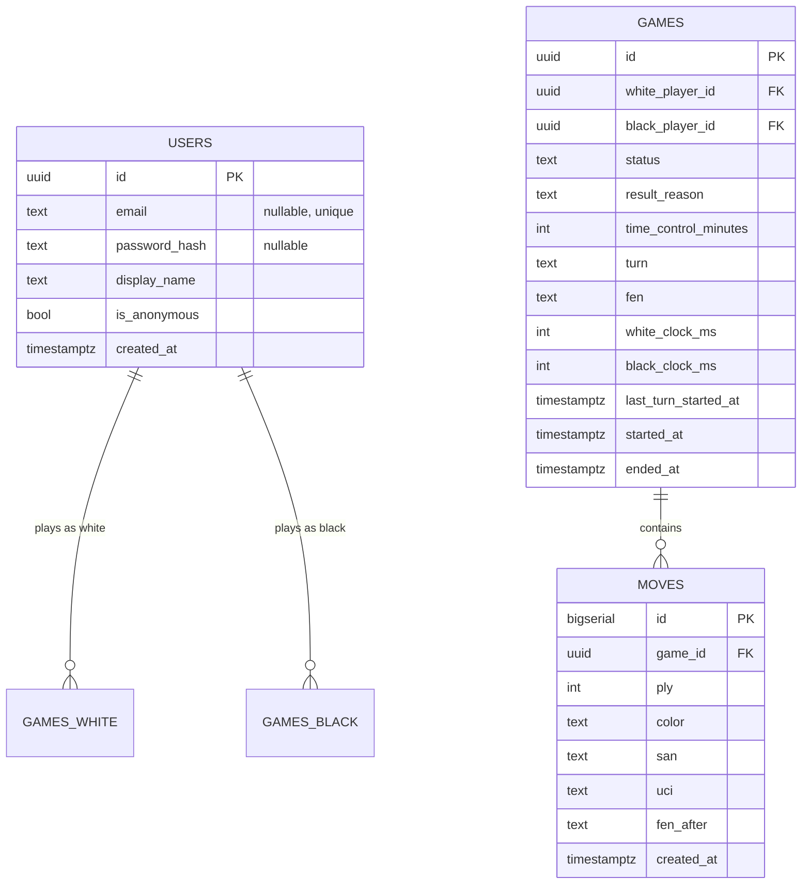

# Entity-Relationship Diagram

```mermaid
erDiagram
    USERS ||--o{ GAMES_WHITE : "plays as white"
    USERS ||--o{ GAMES_BLACK : "plays as black"
    GAMES ||--o{ MOVES : "contains"

    USERS {
        uuid id PK
        text email "nullable, unique"
        text password_hash "nullable"
        text display_name
        bool is_anonymous
        timestamptz created_at
    }
    GAMES {
        uuid id PK
        uuid white_player_id FK
        uuid black_player_id FK
        text status
        text result_reason
        int time_control_minutes
        text turn
        text fen
        int white_clock_ms
        int black_clock_ms
        timestamptz last_turn_started_at
        timestamptz started_at
        timestamptz ended_at
    }
    MOVES {
        bigserial id PK
        uuid game_id FK
        int ply
        text color
        text san
        text uci
        text fen_after
        timestamptz created_at
    }
```
