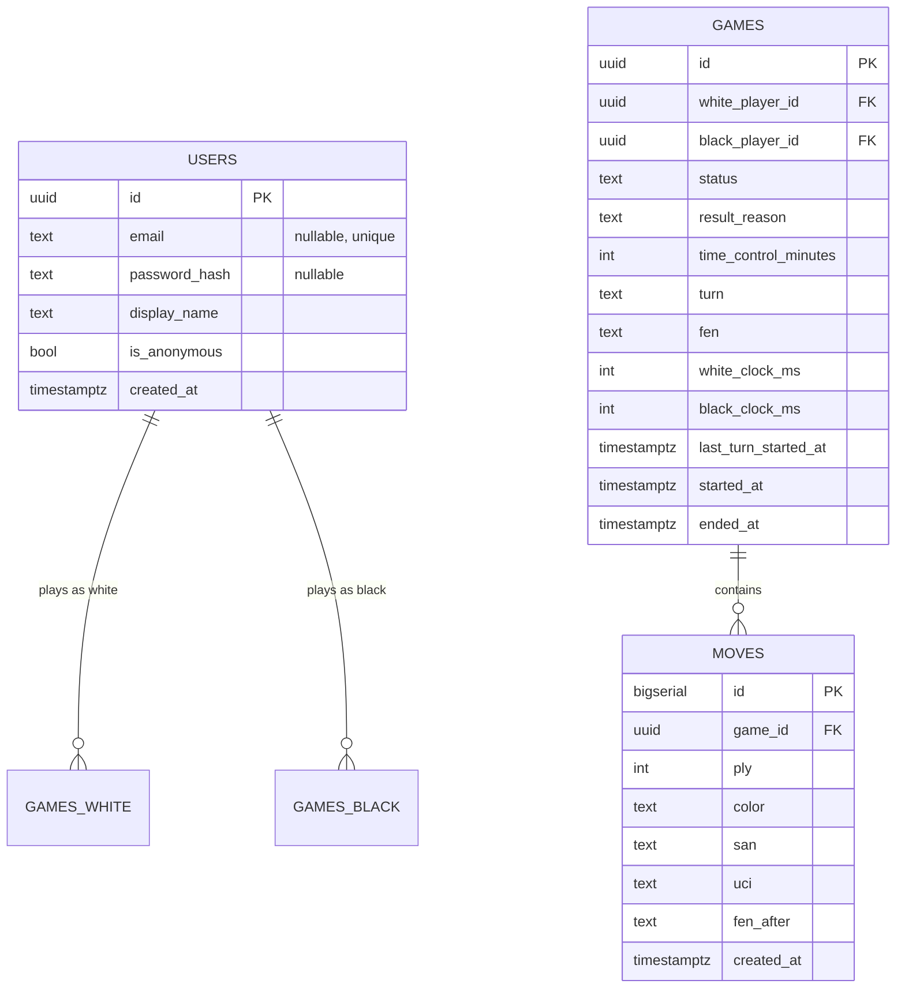

# Phase 3 — Multiplayer, User Profiles & Database: Implementation Plan

> **For agentic workers:** REQUIRED SUB-SKILL: Use superpowers:subagent-driven-development (recommended) or superpowers:executing-plans to implement this plan task-by-task. Steps use checkbox (`- [ ]`) syntax for tracking.

**Goal:** Add online multiplayer to the chess app: email/password or anonymous-guest auth, shareable-link game invites, realtime play over WebSockets with server-authoritative `python-chess` rules and clocks, Postgres persistence, and a profile stats dashboard.

**Architecture:** A new FastAPI backend (`services/api`) owns HTTP (auth, game CRUD, profile) and a per-game WebSocket endpoint. It validates every move with `python-chess`, persists to Postgres, and broadcasts authoritative state. The Next.js client gains an `'online'` game mode: `useAuth` (tokens), `useOnlineGame` (WS + reconnect), and `OnlineGame` (renders server state, sends move intents). `chess.js` on the client only *proposes* moves and highlights legal targets; `python-chess` on the server is the single source of truth for the shared game.

**Tech Stack:** Next.js 16 App Router + TypeScript + Tailwind (existing), chess.js 1.4, react-chessboard 5.12, Vitest 4. Python 3.12, FastAPI, Uvicorn, SQLAlchemy 2 (async), asyncpg (runtime) / aiosqlite (tests), python-chess, argon2-cffi, PyJWT, email-validator, Alembic, pytest + pytest-asyncio + httpx. PostgreSQL 16 (docker-compose).

## Global Constraints

- pnpm is the web package manager; pip + `pyproject.toml` for the API. Never npm/yarn/poetry.
- Conventional Commits; one commit per task.
- `python-chess` is the ONLY server-side move validator; `chess.js` is the ONLY client-side validator. Never hand-roll rules on either side.
- Server-authoritative: the client never mutates authoritative state — it sends move intents and renders whatever the server broadcasts.
- No ratings/Elo, no spectators, no OAuth/magic-link, no clock increments (all deferred).
- Email/password + anonymous guests only; anonymous users upgrade via a `claim` endpoint.
- Mobile-first: game content constrained to `max-w-md`.
- TDD: write the failing test, watch it fail, implement, watch it pass, then commit.
- Backend tests run with `pytest` from `services/api` against a temp-file SQLite (`aiosqlite` + `NullPool`); runtime uses Postgres via asyncpg. `Base.metadata.create_all` only when `CREATE_TABLES_ON_STARTUP=1`.
- Frontend tests run from `apps/web` with `pnpm test` (vitest run).
- Run the full build + lint + test suites once at the end (Task 16), not per task.
- Branch: `phase-3-multiplayer` (already created).
- Bearer tokens in `localStorage` (v1); access token 15 min, refresh token 30 days.

## File Structure

| File | Responsibility |
|------|----------------|
| `services/api/pyproject.toml` | deps, pytest config |
| `services/api/app/config.py` | `Settings` (env) |
| `services/api/app/db.py` | async engine (`NullPool`), session factory, `get_session` |
| `services/api/app/models.py` | `User`, `Game`, `Move` ORM models |
| `services/api/app/schemas.py` | Pydantic request/response models |
| `services/api/app/main.py` | app factory, CORS, lifespan (optional create_all), routers, `/health` |
| `services/api/app/auth/security.py` | argon2 hashing, JWT issue/decode |
| `services/api/app/auth/deps.py` | `get_current_user`, `user_from_token` |
| `services/api/app/auth/routes.py` | register/login/anonymous/refresh/logout/claim/me |
| `services/api/app/games/chess_engine.py` | `board_from_uci_moves`, `apply_move`, `terminal_reason`, `export_pgn`, `STARTING_FEN` |
| `services/api/app/games/clock.py` | `elapsed_ms`, `decrement`, `timeout_side` |
| `services/api/app/games/routes.py` | create/get/abort game |
| `services/api/app/games/ws.py` | WebSocket endpoint, `GameSession`, `GameRegistry` |
| `services/api/app/profile.py` | `/me/stats` |
| `services/api/migrations/` | Alembic (initial migration) |
| `services/api/tests/conftest.py` | env setup, `client` + `ws_client` + `db` fixtures |
| `services/api/Dockerfile` | uvicorn + alembic entrypoint |
| `docker-compose.yml` | + `db` (postgres:16), + `api` |
| `apps/web/lib/types.ts` | `GameMode` gains `'online'`; `OnlineStatus`, `ResultReason`, `OnlinePlayer`, `OnlineGameState` |
| `apps/web/lib/api.ts` | token storage, `apiFetch`, auth/game REST, `wsUrl` |
| `apps/web/hooks/useAuth.ts` | token lifecycle, `login`/`register`/`guest`/`logout`/`getAccessToken` |
| `apps/web/hooks/useOnlineGame.ts` | WS connect + reconnect, `sendMove`/`resign`/`offerDraw`/`acceptDraw`/`declineDraw` |
| `apps/web/components/AuthForms.tsx` | login/register toggle + guest button |
| `apps/web/components/OnlineGame.tsx` | board orchestrator (online mode) |
| `apps/web/app/online/page.tsx` | create-game lobby |
| `apps/web/app/game/[id]/page.tsx` | the online game |
| `apps/web/app/page.tsx` | homepage gains "Play online" entry |
| `docs/erd.md` | data model diagram (updated in Task 16) |

---

### Task 1: FastAPI scaffolding + test harness

**Files:**
- Create: `services/api/pyproject.toml`
- Create: `services/api/app/__init__.py`, `services/api/app/config.py`, `services/api/app/db.py`, `services/api/app/main.py`
- Create: `services/api/app/auth/__init__.py`, `services/api/app/games/__init__.py` (empty)
- Create: `services/api/tests/__init__.py`, `services/api/tests/conftest.py`, `services/api/tests/test_health.py`
- Modify: `docker-compose.yml` (add `api` service only; `db` added in Task 2)

**Interfaces:**
- Consumes: nothing (first task).
- Produces: `Settings` (config), `engine`, `SessionLocal`, `get_session` (db), `app` (main FastAPI instance). These are imported by every later task.

- [ ] **Step 1: Write the config, db, and app skeleton**

Create `services/api/pyproject.toml`:

```toml
[project]
name = "chess-trainer-api"
version = "0.1.0"
requires-python = ">=3.12"
dependencies = [
    "fastapi>=0.115",
    "uvicorn[standard]>=0.30",
    "sqlalchemy[asyncio]>=2.0",
    "asyncpg>=0.29",
    "aiosqlite>=0.20",
    "python-chess>=1.999",
    "argon2-cffi>=23.1",
    "PyJWT>=2.9",
    "email-validator>=2.2",
    "pydantic-settings>=2.4",
    "alembic>=1.13",
]

[project.optional-dependencies]
dev = [
    "pytest>=8.3",
    "pytest-asyncio>=0.24",
    "httpx>=0.27",
]

[tool.pytest.ini_options]
asyncio_mode = "auto"
testpaths = ["tests"]
```

Create `services/api/app/config.py`:

```python
from pydantic_settings import BaseSettings, SettingsConfigDict


class Settings(BaseSettings):
    model_config = SettingsConfigDict(env_file=".env", extra="ignore")

    database_url: str = "sqlite+aiosqlite:///./chess.db"
    jwt_secret: str = "dev-secret-change-me"
    access_token_minutes: int = 15
    refresh_token_days: int = 30
    cors_origins: str = "http://localhost:3000"
    create_tables_on_startup: bool = False

    @property
    def cors_origin_list(self) -> list[str]:
        return [o.strip() for o in self.cors_origins.split(",") if o.strip()]


settings = Settings()
```

Create `services/api/app/db.py`:

```python
from sqlalchemy.ext.asyncio import AsyncSession, async_sessionmaker, create_async_engine
from sqlalchemy.pool import NullPool

from .config import settings

engine = create_async_engine(settings.database_url, poolclass=NullPool)
SessionLocal = async_sessionmaker(engine, class_=AsyncSession, expire_on_commit=False)


async def get_session() -> AsyncSession:
    async with SessionLocal() as session:
        yield session
```

Create `services/api/app/main.py`:

```python
from contextlib import asynccontextmanager

from fastapi import FastAPI
from fastapi.middleware.cors import CORSMiddleware

from .config import settings
from .db import engine
from .models import Base


@asynccontextmanager
async def lifespan(app: FastAPI):
    if settings.create_tables_on_startup:
        async with engine.begin() as conn:
            await conn.run_sync(Base.metadata.create_all)
    yield


app = FastAPI(title="chess-trainer-api", lifespan=lifespan)

app.add_middleware(
    CORSMiddleware,
    allow_origins=settings.cors_origin_list,
    allow_credentials=True,
    allow_methods=["*"],
    allow_headers=["*"],
)


@app.get("/health")
async def health() -> dict:
    return {"status": "ok"}
```

- [ ] **Step 2: Create empty `models.py` placeholder so `main.py` imports**

Create `services/api/app/models.py`:

```python
from sqlalchemy.orm import DeclarativeBase


class Base(DeclarativeBase):
    pass
```

- [ ] **Step 3: Write the test harness and a health test**

Create `services/api/tests/conftest.py`:

```python
import os
import tempfile

# Set env BEFORE importing app so settings pick these up.
os.environ["DATABASE_URL"] = f"sqlite+aiosqlite:///{tempfile.mkdtemp()}/test.db"
os.environ["JWT_SECRET"] = "test-secret"
os.environ["CREATE_TABLES_ON_STARTUP"] = "1"

import pytest
from fastapi.testclient import TestClient
from sqlalchemy import text
from sqlalchemy.ext.asyncio import async_sessionmaker, create_async_engine
from sqlalchemy.pool import NullPool

from app.main import app
from app.models import Base


@pytest.fixture(scope="session")
def engine():
    from app.config import settings
    e = create_async_engine(settings.database_url, poolclass=NullPool)
    return e


@pytest.fixture
def client():
    # TestClient's `with` triggers lifespan -> create_all on the same loop.
    with TestClient(app) as c:
        yield c


@pytest.fixture
def db(engine):
    import asyncio

    async def reset():
        async with engine.begin() as conn:
            # Truncate all tables between tests (SQLite-safe order).
            await conn.execute(text("DELETE FROM moves"))
            await conn.execute(text("DELETE FROM games"))
            await conn.execute(text("DELETE FROM users"))

    asyncio.run(reset())
    yield
    asyncio.run(reset())
```

Create `services/api/tests/test_health.py`:

```python
def test_health(client):
    resp = client.get("/health")
    assert resp.status_code == 200
    assert resp.json() == {"status": "ok"}
```

- [ ] **Step 4: Install deps and run the health test**

Run: `cd services/api && python -m pip install -e ".[dev]" && pytest tests/test_health.py -v`
Expected: PASS (`test_health`).

- [ ] **Step 5: Add the `api` service to docker-compose**

Modify `docker-compose.yml`:

```yaml
services:
  api:
    build:
      context: ./services/api
    ports:
      - "8000:8000"
    environment:
      - DATABASE_URL=postgresql+asyncpg://chess:chess@db:5432/chess
      - JWT_SECRET=dev-secret-change-me
      - CREATE_TABLES_ON_STARTUP=1
    depends_on:
      - db
  web:
    build:
      context: .
    ports:
      - "3000:3000"
    environment:
      - NODE_ENV=production
      - NEXT_PUBLIC_API_URL=http://localhost:8000
```

(The `db` service is added in Task 2; `depends_on` is harmless until then.)

- [ ] **Step 6: Commit**

```bash
git add services/api docker-compose.yml
git commit -m "feat: scaffold FastAPI service with health check and test harness"
```

---

### Task 2: Data models + Alembic migration + `db` service

**Files:**
- Modify: `services/api/app/models.py` (full `User`/`Game`/`Move`)
- Create: `services/api/migrations/env.py`, `services/api/migrations/script.py.mako`, `services/api/alembic.ini`
- Create: `services/api/tests/test_models.py`
- Create: `services/api/Dockerfile`
- Create: `services/api/.dockerignore`
- Modify: `docker-compose.yml` (add `db` service)

**Interfaces:**
- Consumes: `Base` (from Task 1).
- Produces: `User`, `Game`, `Move` ORM classes; `utcnow()` helper; column names used by every later task.

- [ ] **Step 1: Write the failing model test**

Create `services/api/tests/test_models.py`:

```python
import uuid

import chess


def test_game_defaults():
    from app.models import Game
    g = Game(time_control_minutes=10, white_clock_ms=600_000, black_clock_ms=600_000)
    assert g.id is not None
    assert g.fen == chess.STARTING_FEN
    assert g.status == "waiting"
    assert g.turn == "w"
    assert g.white_player_id is None
    assert g.black_player_id is None


def test_user_anonymous_default():
    from app.models import User
    u = User(display_name="guest")
    assert u.is_anonymous is True
    assert u.email is None
    assert u.password_hash is None
```

- [ ] **Step 2: Run to verify failure**

Run: `pytest tests/test_models.py -v`
Expected: FAIL (`ModuleNotFoundError: No module named 'app.models'` or `AttributeError`).

- [ ] **Step 3: Implement the models**

Replace `services/api/app/models.py`:

```python
import uuid
from datetime import datetime, timezone

import chess
from sqlalchemy import Boolean, DateTime, ForeignKey, Integer, Text, Uuid
from sqlalchemy.orm import DeclarativeBase, Mapped, mapped_column


class Base(DeclarativeBase):
    pass


def utcnow() -> datetime:
    return datetime.now(timezone.utc)


class User(Base):
    __tablename__ = "users"

    id: Mapped[uuid.UUID] = mapped_column(Uuid, primary_key=True, default=uuid.uuid4)
    email: Mapped[str | None] = mapped_column(Text, unique=True, nullable=True)
    password_hash: Mapped[str | None] = mapped_column(Text, nullable=True)
    display_name: Mapped[str] = mapped_column(Text, default="guest")
    is_anonymous: Mapped[bool] = mapped_column(Boolean, default=True)
    created_at: Mapped[datetime] = mapped_column(DateTime(timezone=True), default=utcnow)


class Game(Base):
    __tablename__ = "games"

    id: Mapped[uuid.UUID] = mapped_column(Uuid, primary_key=True, default=uuid.uuid4)
    white_player_id: Mapped[uuid.UUID | None] = mapped_column(ForeignKey("users.id"), nullable=True)
    black_player_id: Mapped[uuid.UUID | None] = mapped_column(ForeignKey("users.id"), nullable=True)
    status: Mapped[str] = mapped_column(Text, default="waiting")
    result_reason: Mapped[str | None] = mapped_column(Text, nullable=True)
    time_control_minutes: Mapped[int] = mapped_column(Integer, default=10)
    turn: Mapped[str] = mapped_column(Text, default="w")
    fen: Mapped[str] = mapped_column(Text, default=chess.STARTING_FEN)
    white_clock_ms: Mapped[int] = mapped_column(Integer)
    black_clock_ms: Mapped[int] = mapped_column(Integer)
    last_turn_started_at: Mapped[datetime] = mapped_column(DateTime(timezone=True), default=utcnow)
    started_at: Mapped[datetime | None] = mapped_column(DateTime(timezone=True), nullable=True)
    ended_at: Mapped[datetime | None] = mapped_column(DateTime(timezone=True), nullable=True)


class Move(Base):
    __tablename__ = "moves"

    id: Mapped[int] = mapped_column(Integer, primary_key=True, autoincrement=True)
    game_id: Mapped[uuid.UUID] = mapped_column(ForeignKey("games.id"))
    ply: Mapped[int] = mapped_column(Integer)
    color: Mapped[str] = mapped_column(Text)
    san: Mapped[str] = mapped_column(Text)
    uci: Mapped[str] = mapped_column(Text)
    fen_after: Mapped[str] = mapped_column(Text)
    created_at: Mapped[datetime] = mapped_column(DateTime(timezone=True), default=utcnow)
```

- [ ] **Step 4: Run to verify pass**

Run: `pytest tests/test_models.py -v`
Expected: PASS.

- [ ] **Step 5: Add the Alembic initial migration**

Create `services/api/alembic.ini`, `services/api/migrations/env.py`, and `services/api/migrations/script.py.mako` using the standard async template, then generate the migration:

Run (from `services/api`):
```
alembic init migrations
alembic revision --autogenerate -m "initial users games moves"
```

(If `alembic init` created a fresh `env.py`, replace its `target_metadata` wiring with `from app.models import Base; target_metadata = Base.metadata` and point `sqlalchemy.url` to `settings.database_url` via an env override. The generated revision must create `users`, `games`, `moves` with the columns above.)

- [ ] **Step 6: Add the `db` service to docker-compose**

Modify `docker-compose.yml` to include (before `api`):

```yaml
  db:
    image: postgres:16-alpine
    environment:
      - POSTGRES_USER=chess
      - POSTGRES_PASSWORD=chess
      - POSTGRES_DB=chess
    volumes:
      - pgdata:/var/lib/postgresql/data
    healthcheck:
      test: ["CMD-SHELL", "pg_isready -U chess -d chess"]
      interval: 5s
      timeout: 5s
      retries: 5
```

Add `volumes: { pgdata: {} }` at the top level.

- [ ] **Step 7: Create the API Dockerfile and `.dockerignore`**

Create `services/api/Dockerfile`:

```dockerfile
FROM python:3.12-slim

WORKDIR /app

COPY . .

RUN pip install --no-cache-dir .

EXPOSE 8000

CMD ["sh", "-c", "alembic upgrade head && uvicorn app.main:app --host 0.0.0.0 --port 8000"]
```

Create `services/api/.dockerignore`:

```
.venv
__pycache__
*.pyc
.pytest_cache
tests
*.db
.env
```

- [ ] **Step 8: Commit**

```bash
git add services/api docker-compose.yml
git commit -m "feat: add users/games/moves models, migration, and postgres service"
```

---

### Task 3: Auth security primitives (hashing + JWT + deps)

**Files:**
- Create: `services/api/app/auth/security.py`
- Create: `services/api/app/auth/deps.py`
- Create: `services/api/tests/test_security.py`

**Interfaces:**
- Consumes: `settings` (Task 1), `User` (Task 2).
- Produces: `hash_password`, `verify_password`, `create_access_token`, `create_refresh_token`, `decode_token(token, expected_type) -> uuid.UUID`, `get_current_user(creds, session) -> User`, `user_from_token(token, session) -> User | None`.

- [ ] **Step 1: Write the failing security test**

Create `services/api/tests/test_security.py`:

```python
import uuid

import pytest
from fastapi import HTTPException

from app.auth.security import (
    create_access_token,
    create_refresh_token,
    decode_token,
    hash_password,
    verify_password,
)


def test_password_roundtrip():
    h = hash_password("s3cret!")
    assert h != "s3cret!"
    assert verify_password("s3cret!", h) is True
    assert verify_password("wrong", h) is False


def test_access_token_roundtrip():
    uid = uuid.uuid4()
    tok = create_access_token(uid)
    assert decode_token(tok, "access") == uid


def test_refresh_token_type_enforced():
    uid = uuid.uuid4()
    tok = create_refresh_token(uid)
    with pytest.raises(Exception):
        decode_token(tok, "access")
    assert decode_token(tok, "refresh") == uid


def test_tampered_token_rejected():
    uid = uuid.uuid4()
    tok = create_access_token(uid)
    with pytest.raises(Exception):
        decode_token(tok + "x", "access")
```

- [ ] **Step 2: Run to verify failure**

Run: `pytest tests/test_security.py -v`
Expected: FAIL (`ModuleNotFoundError`).

- [ ] **Step 3: Implement `security.py`**

Create `services/api/app/auth/security.py`:

```python
import uuid
from datetime import datetime, timedelta, timezone

import jwt
from argon2 import PasswordHasher
from argon2.exceptions import VerifyMismatchError

from ..config import settings

_ph = PasswordHasher()
ALG = "HS256"


def hash_password(password: str) -> str:
    return _ph.hash(password)


def verify_password(password: str, password_hash: str) -> bool:
    try:
        return _ph.verify(password_hash, password)
    except VerifyMismatchError:
        return False


def _create_token(user_id: uuid.UUID, token_type: str, expires: timedelta) -> str:
    now = datetime.now(timezone.utc)
    payload = {
        "sub": str(user_id),
        "type": token_type,
        "iat": now,
        "exp": now + expires,
    }
    return jwt.encode(payload, settings.jwt_secret, algorithm=ALG)


def create_access_token(user_id: uuid.UUID) -> str:
    return _create_token(user_id, "access", timedelta(minutes=settings.access_token_minutes))


def create_refresh_token(user_id: uuid.UUID) -> str:
    return _create_token(user_id, "refresh", timedelta(days=settings.refresh_token_days))


def decode_token(token: str, expected_type: str) -> uuid.UUID:
    payload = jwt.decode(token, settings.jwt_secret, algorithms=[ALG])
    if payload.get("type") != expected_type:
        raise jwt.InvalidTokenError("wrong token type")
    return uuid.UUID(payload["sub"])
```

- [ ] **Step 4: Implement `deps.py`**

Create `services/api/app/auth/deps.py`:

```python
import uuid

from fastapi import Depends, HTTPException, status
from fastapi.security import HTTPAuthorizationCredentials, HTTPBearer
from sqlalchemy.ext.asyncio import AsyncSession

from ..db import get_session
from ..models import User
from .security import decode_token

_bearer = HTTPBearer(auto_error=False)


async def get_current_user(
    creds: HTTPAuthorizationCredentials | None = Depends(_bearer),
    session: AsyncSession = Depends(get_session),
) -> User:
    if creds is None:
        raise HTTPException(status.HTTP_401_UNAUTHORIZED, "Not authenticated")
    try:
        user_id = decode_token(creds.credentials, "access")
    except Exception:
        raise HTTPException(status.HTTP_401_UNAUTHORIZED, "Invalid token")
    user = await session.get(User, user_id)
    if user is None:
        raise HTTPException(status.HTTP_401_UNAUTHORIZED, "Unknown user")
    return user


async def user_from_token(token: str, session: AsyncSession) -> User | None:
    try:
        user_id: uuid.UUID = decode_token(token, "access")
    except Exception:
        return None
    return await session.get(User, user_id)
```

- [ ] **Step 5: Run to verify pass**

Run: `pytest tests/test_security.py -v`
Expected: PASS.

- [ ] **Step 6: Commit**

```bash
git add services/api/app/auth services/api/tests/test_security.py
git commit -m "feat: add password hashing and JWT helpers"
```

---

### Task 4: Auth routes (register / login / anonymous / refresh / logout / claim / me)

**Files:**
- Create: `services/api/app/schemas.py`
- Create: `services/api/app/auth/routes.py`
- Modify: `services/api/app/main.py` (include the auth router)
- Create: `services/api/tests/test_auth.py`
- Modify: `services/api/tests/conftest.py` (test isolation fix — see Step 0)

**Interfaces:**
- Consumes: `get_current_user`, `user_from_token`, `hash_password`, `verify_password`, `create_access_token`, `create_refresh_token`, `decode_token` (Task 3); `User` (Task 2).
- Produces: `AuthResponse`, `UserOut`, `TokenPair`, `RegisterRequest`, `LoginRequest` (schemas); `POST /auth/register`, `/auth/login`, `/auth/anonymous`, `/auth/refresh`, `/auth/logout`, `/auth/claim`, `GET /me`.

- [ ] **Step 0: Fix test isolation in `conftest.py`**

The Task 1 `conftest.py` does not reset the DB between tests (its `client` fixture does not depend on `db`, and `db` uses fragile `DELETE` statements). Fix both so each test gets a fresh schema:

Replace the `client` fixture (make it depend on `db`) and the `db` fixture (use `drop_all` + `create_all`):

```python
@pytest.fixture
def client(db):
    # TestClient's `with` triggers lifespan -> create_all (a no-op after db reset).
    with TestClient(app) as c:
        yield c


@pytest.fixture
def db(engine):
    import asyncio

    async def reset():
        async with engine.begin() as conn:
            await conn.run_sync(Base.metadata.drop_all)
            await conn.run_sync(Base.metadata.create_all)

    asyncio.run(reset())
    yield
```

(Remove the now-unused `from sqlalchemy import text` import.)

- [ ] **Step 1: Write the failing auth test**

Create `services/api/tests/test_auth.py`:

```python
def _register(client, email="a@b.co", password="pw123456", name="Ann"):
    return client.post("/auth/register", json={"email": email, "password": password, "display_name": name})


def test_register_and_me(client):
    r = _register(client)
    assert r.status_code == 200, r.text
    body = r.json()
    assert body["user"]["email"] == "a@b.co"
    assert body["user"]["is_anonymous"] is False
    assert "access_token" in body["tokens"]

    me = client.get("/me", headers={"Authorization": f"Bearer {body['tokens']['access_token']}"})
    assert me.status_code == 200
    assert me.json()["email"] == "a@b.co"


def test_login_success_and_failure(client):
    _register(client)
    ok = client.post("/auth/login", json={"email": "a@b.co", "password": "pw123456"})
    assert ok.status_code == 200
    bad = client.post("/auth/login", json={"email": "a@b.co", "password": "nope"})
    assert bad.status_code == 401


def test_duplicate_email_rejected(client):
    _register(client)
    dup = _register(client)
    assert dup.status_code == 409


def test_anonymous_then_claim(client):
    anon = client.post("/auth/anonymous")
    assert anon.status_code == 200
    body = anon.json()
    assert body["user"]["is_anonymous"] is True
    assert body["user"]["email"] is None

    tok = body["tokens"]["access_token"]
    claim = client.post("/auth/claim", json={"email": "c@d.co", "password": "pw123456"},
                        headers={"Authorization": f"Bearer {tok}"})
    assert claim.status_code == 200
    assert claim.json()["user"]["email"] == "c@d.co"
    assert claim.json()["user"]["is_anonymous"] is False


def test_refresh(client):
    body = _register(client).json()
    r = client.post("/auth/refresh", json={"refresh_token": body["tokens"]["refresh_token"]})
    assert r.status_code == 200
    assert "access_token" in r.json()["tokens"]
```

- [ ] **Step 2: Run to verify failure**

Run: `pytest tests/test_auth.py -v`
Expected: FAIL (`404 Not Found` on `/auth/register`).

- [ ] **Step 3: Implement `schemas.py`**

Create `services/api/app/schemas.py`:

```python
import uuid

from pydantic import BaseModel, EmailStr


class RegisterRequest(BaseModel):
    email: EmailStr
    password: str
    display_name: str = "Player"


class LoginRequest(BaseModel):
    email: EmailStr
    password: str


class ClaimRequest(BaseModel):
    email: EmailStr
    password: str


class RefreshRequest(BaseModel):
    refresh_token: str


class TokenPair(BaseModel):
    access_token: str
    refresh_token: str


class UserOut(BaseModel):
    id: uuid.UUID
    email: str | None
    display_name: str
    is_anonymous: bool


class AuthResponse(BaseModel):
    user: UserOut
    tokens: TokenPair
```

- [ ] **Step 4: Implement `auth/routes.py`**

Create `services/api/app/auth/routes.py`:

```python
import uuid

from fastapi import APIRouter, Depends, HTTPException, status
from sqlalchemy import select
from sqlalchemy.ext.asyncio import AsyncSession

from ..db import get_session
from ..models import User
from ..schemas import (
    AuthResponse,
    ClaimRequest,
    LoginRequest,
    RefreshRequest,
    RegisterRequest,
    TokenPair,
    UserOut,
)
from .deps import get_current_user, user_from_token
from .security import (
    create_access_token,
    create_refresh_token,
    decode_token,
    hash_password,
    verify_password,
)

router = APIRouter(prefix="/auth", tags=["auth"])


def _to_out(user: User) -> UserOut:
    return UserOut(id=user.id, email=user.email, display_name=user.display_name, is_anonymous=user.is_anonymous)


def _tokens(user: User) -> TokenPair:
    return TokenPair(access_token=create_access_token(user.id), refresh_token=create_refresh_token(user.id))


def _auth_response(user: User) -> AuthResponse:
    return AuthResponse(user=_to_out(user), tokens=_tokens(user))


@router.post("/register", response_model=AuthResponse)
async def register(body: RegisterRequest, session: AsyncSession = Depends(get_session)):
    existing = await session.scalar(select(User).where(User.email == body.email.lower()))
    if existing is not None:
        raise HTTPException(status.HTTP_409_CONFLICT, "Email already registered")
    user = User(
        email=body.email.lower(),
        password_hash=hash_password(body.password),
        display_name=body.display_name,
        is_anonymous=False,
    )
    session.add(user)
    await session.commit()
    return _auth_response(user)


@router.post("/login", response_model=AuthResponse)
async def login(body: LoginRequest, session: AsyncSession = Depends(get_session)):
    user = await session.scalar(select(User).where(User.email == body.email.lower()))
    if user is None or user.password_hash is None or not verify_password(body.password, user.password_hash):
        raise HTTPException(status.HTTP_401_UNAUTHORIZED, "Invalid credentials")
    return _auth_response(user)


@router.post("/anonymous", response_model=AuthResponse)
async def anonymous(session: AsyncSession = Depends(get_session)):
    user = User(display_name="Guest", is_anonymous=True)
    session.add(user)
    await session.commit()
    return _auth_response(user)


@router.post("/refresh", response_model=AuthResponse)
async def refresh(body: RefreshRequest, session: AsyncSession = Depends(get_session)):
    try:
        user_id = decode_token(body.refresh_token, "refresh")
    except Exception:
        raise HTTPException(status.HTTP_401_UNAUTHORIZED, "Invalid refresh token")
    user = await session.get(User, user_id)
    if user is None:
        raise HTTPException(status.HTTP_401_UNAUTHORIZED, "Unknown user")
    return _auth_response(user)


@router.post("/logout")
async def logout():
    # Stateless v1: the client discards tokens. No server-side revocation.
    return {"status": "ok"}


@router.post("/claim", response_model=AuthResponse)
async def claim(body: ClaimRequest, user: User = Depends(get_current_user), session: AsyncSession = Depends(get_session)):
    if not user.is_anonymous:
        raise HTTPException(status.HTTP_400_BAD_REQUEST, "Account already has credentials")
    existing = await session.scalar(select(User).where(User.email == body.email.lower()))
    if existing is not None:
        raise HTTPException(status.HTTP_409_CONFLICT, "Email already registered")
    user.email = body.email.lower()
    user.password_hash = hash_password(body.password)
    user.is_anonymous = False
    await session.commit()
    return _auth_response(user)


@router.get("/me", response_model=UserOut)
async def me(user: User = Depends(get_current_user)):
    return _to_out(user)
```

- [ ] **Step 5: Wire the router into `main.py`**

Modify `services/api/app/main.py` — add after CORS setup:

```python
from .auth.routes import router as auth_router

app.include_router(auth_router)
```

- [ ] **Step 6: Run to verify pass**

Run: `pytest tests/test_auth.py -v`
Expected: PASS.

- [ ] **Step 7: Commit**

```bash
git add services/api/app
git commit -m "feat: add email/password and anonymous auth endpoints"
```

---

### Task 5: python-chess engine wrapper

**Files:**
- Create: `services/api/app/games/chess_engine.py`
- Create: `services/api/tests/test_chess_engine.py`

**Interfaces:**
- Consumes: nothing (pure `python-chess`).
- Produces: `STARTING_FEN`, `MoveResult` dataclass, `board_from_uci_moves(uci_moves) -> chess.Board`, `terminal_reason(board) -> str | None`, `apply_move(board, uci) -> MoveResult`, `export_pgn(board, white_name, black_name, result) -> str`.

- [ ] **Step 1: Write the failing engine test**

Create `services/api/tests/test_chess_engine.py`:

```python
import chess

from app.games.chess_engine import apply_move, board_from_uci_moves, terminal_reason


def test_apply_normal_move():
    board = chess.Board()
    r = apply_move(board, "e2e4")
    assert r.ok is True
    assert r.san == "e4"
    assert r.fen == board.fen()
    assert r.result_reason is None


def test_apply_illegal_move():
    board = chess.Board()
    r = apply_move(board, "e2e5")
    assert r.ok is False
    assert r.reason == "illegal"


def test_capture_records_captured_piece():
    board = board_from_uci_moves(["e2e4", "d7d5", "e4d5"])
    r = apply_move(board, "e4d5")
    assert r.captured == "p"


def test_en_passant_captures_pawn():
    board = board_from_uci_moves(["e2e4", "a7a6", "e4e5", "d7d5"])
    r = apply_move(board, "e5d6")
    assert r.captured == "p"


def test_promotion():
    board = board_from_uci_moves(["g2g4", "h7h5", "g4h5", "a7a6", "h5h6", "a6a5", "h6g7", "a5a4"])
    r = apply_move(board, "g7g8q")
    assert r.ok is True
    assert r.san == "g8=Q"
    assert r.result_reason is None


def test_checkmate_detected():
    board = board_from_uci_moves(["f2f3", "e7e5", "g2g4", "d8h4"])
    r = apply_move(board, "d8h4")
    assert r.result_reason == "checkmate"
    assert r.winner == "b"


def test_stalemate_detected():
    board = board_from_uci_moves(["e2e3", "a7a5", "d1h5", "a8a6", "h5a5", "h7h5", "h2h4", "a6h6", "a5c7", "f7f6", "c7d7", "e8f7", "d7b7", "d8d3", "b7b8", "d3h7", "b8c8", "f7g6", "c8e6"])
    r = apply_move(board, "c8e6")
    assert r.result_reason == "stalemate"


def test_threefold_detected():
    board = chess.Board()
    for uci in ["g1f3", "g8f6", "f3g1", "f6g8", "g1f3", "g8f6", "f3g1", "f6g8"]:
        apply_move(board, uci)
    assert terminal_reason(board) == "threefold"
```

- [ ] **Step 2: Run to verify failure**

Run: `pytest tests/test_chess_engine.py -v`
Expected: FAIL (`ModuleNotFoundError`).

- [ ] **Step 3: Implement `chess_engine.py`**

Create `services/api/app/games/chess_engine.py`:

```python
from dataclasses import dataclass

import chess

STARTING_FEN = chess.STARTING_FEN


@dataclass
class MoveResult:
    ok: bool
    reason: str | None = None
    san: str | None = None
    uci: str | None = None
    fen: str | None = None
    captured: str | None = None
    result_reason: str | None = None
    winner: str | None = None


def board_from_uci_moves(uci_moves: list[str]) -> chess.Board:
    board = chess.Board()
    for u in uci_moves:
        board.push_uci(u)
    return board


def terminal_reason(board: chess.Board) -> str | None:
    if board.is_checkmate():
        return "checkmate"
    if board.is_stalemate():
        return "stalemate"
    if board.is_insufficient_material():
        return "insufficient"
    if board.can_claim_threefold_repetition():
        return "threefold"
    if board.can_claim_fifty_moves():
        return "fifty-move"
    return None


def _winner_for(board: chess.Board, reason: str) -> str | None:
    if reason == "checkmate":
        return "w" if board.turn == chess.BLACK else "b"
    return None


def apply_move(board: chess.Board, uci: str) -> MoveResult:
    try:
        move = board.parse_uci(uci)
    except ValueError:
        return MoveResult(ok=False, reason="illegal")
    if move not in board.legal_moves:
        return MoveResult(ok=False, reason="illegal")

    captured = None
    if board.is_capture(move):
        piece = board.piece_at(move.to_square)
        captured = "p" if piece is None else piece.symbol().lower()

    san = board.san(move)
    board.push(move)
    reason = terminal_reason(board)
    return MoveResult(
        ok=True,
        san=san,
        uci=move.uci(),
        fen=board.fen(),
        captured=captured,
        result_reason=reason,
        winner=_winner_for(board, reason) if reason else None,
    )


def export_pgn(board: chess.Board, white_name: str, black_name: str, result: str) -> str:
    game = chess.pgn.Game.from_board(board)
    game.headers["White"] = white_name
    game.headers["Black"] = black_name
    game.headers["Result"] = result
    return str(game)
```

- [ ] **Step 4: Run to verify pass**

Run: `pytest tests/test_chess_engine.py -v`
Expected: PASS.

- [ ] **Step 5: Commit**

```bash
git add services/api/app/games/chess_engine.py services/api/tests/test_chess_engine.py
git commit -m "feat: add python-chess move validation wrapper"
```

---

### Task 6: Clock math

**Files:**
- Create: `services/api/app/games/clock.py`
- Create: `services/api/tests/test_clock.py`

**Interfaces:**
- Consumes: nothing.
- Produces: `elapsed_ms(last_turn_started_at, now) -> int`, `decrement(clock_ms, elapsed) -> int`, `timeout_side(clock_ms, elapsed) -> bool`.

- [ ] **Step 1: Write the failing clock test**

Create `services/api/tests/test_clock.py`:

```python
from datetime import datetime, timedelta, timezone

from app.games.clock import decrement, elapsed_ms, timeout_side


def test_elapsed_ms():
    start = datetime(2026, 1, 1, tzinfo=timezone.utc)
    now = start + timedelta(seconds=2.5)
    assert elapsed_ms(start, now) == 2500


def test_elapsed_clamped_at_zero():
    start = datetime(2026, 1, 1, tzinfo=timezone.utc)
    assert elapsed_ms(start, start - timedelta(seconds=1)) == 0


def test_decrement():
    assert decrement(600_000, 1_000) == 599_000
    assert decrement(500, 1_000) == 0


def test_timeout_side():
    assert timeout_side(500, 1_000) is True
    assert timeout_side(1_000, 999) is False
```

- [ ] **Step 2: Run to verify failure**

Run: `pytest tests/test_clock.py -v`
Expected: FAIL (`ModuleNotFoundError`).

- [ ] **Step 3: Implement `clock.py`**

Create `services/api/app/games/clock.py`:

```python
from datetime import datetime


def elapsed_ms(last_turn_started_at: datetime, now: datetime) -> int:
    delta = (now - last_turn_started_at).total_seconds() * 1000
    return max(0, int(delta))


def decrement(clock_ms: int, elapsed: int) -> int:
    return max(0, clock_ms - elapsed)


def timeout_side(clock_ms: int, elapsed: int) -> bool:
    return clock_ms - elapsed <= 0
```

- [ ] **Step 4: Run to verify pass**

Run: `pytest tests/test_clock.py -v`
Expected: PASS.

- [ ] **Step 5: Commit**

```bash
git add services/api/app/games/clock.py services/api/tests/test_clock.py
git commit -m "feat: add server clock math helpers"
```

---

### Task 7: Game REST routes (create / get / abort)

**Files:**
- Modify: `services/api/app/schemas.py` (add `GameCreate`, `GameSummary`, `GameOut`)
- Create: `services/api/app/games/routes.py`
- Modify: `services/api/app/main.py` (include games router)
- Create: `services/api/tests/test_games.py`

**Interfaces:**
- Consumes: `get_current_user` (Task 3), `Game`/`Move` (Task 2), `STARTING_FEN` (Task 5).
- Produces: `POST /games` → `GameOut`; `GET /games/{id}` → `GameSummary`; `POST /games/{id}/abort`. `GameOut`/`GameSummary` shapes used by the WS layer and the frontend.

- [ ] **Step 1: Write the failing games test**

Create `services/api/tests/test_games.py`:

```python
import uuid


def _anon(client):
    return client.post("/auth/anonymous").json()


def _auth(client, body):
    return {"Authorization": f"Bearer {body['tokens']['access_token']}"}


def test_create_game_assigns_white_seat(client):
    body = _anon(client)
    r = client.post("/games", json={"side": "white", "time_control_minutes": 5}, headers=_auth(client, body))
    assert r.status_code == 200, r.text
    game = r.json()
    assert game["id"]
    assert game["status"] == "waiting"
    assert game["white_player_id"] == body["user"]["id"]
    assert game["black_player_id"] is None
    assert game["fen"].startswith("rnbqkbnr")
    assert game["white_clock_ms"] == 300_000
    assert game["black_clock_ms"] == 300_000


def test_create_game_black_side(client):
    body = _anon(client)
    r = client.post("/games", json={"side": "black", "time_control_minutes": 10}, headers=_auth(client, body))
    assert r.json()["black_player_id"] == body["user"]["id"]


def test_create_requires_auth(client):
    r = client.post("/games", json={"side": "white"})
    assert r.status_code == 401


def test_get_game_summary(client):
    body = _anon(client)
    game = client.post("/games", json={"side": "white"}, headers=_auth(client, body)).json()
    r = client.get(f"/games/{game['id']}")
    assert r.status_code == 200
    assert r.json()["id"] == game["id"]


def test_abort_waiting_game(client):
    body = _anon(client)
    game = client.post("/games", json={"side": "white"}, headers=_auth(client, body)).json()
    r = client.post(f"/games/{game['id']}/abort", headers=_auth(client, body))
    assert r.status_code == 200
    assert client.get(f"/games/{game['id']}").json()["status"] == "aborted"


def test_abort_forbidden_for_non_creator(client):
    body = _anon(client)
    game = client.post("/games", json={"side": "white"}, headers=_auth(client, body)).json()
    other = _anon(client)
    r = client.post(f"/games/{game['id']}/abort", headers=_auth(client, other))
    assert r.status_code == 403
```

- [ ] **Step 2: Run to verify failure**

Run: `pytest tests/test_games.py -v`
Expected: FAIL (`404 Not Found` on `POST /games`).

- [ ] **Step 3: Add schemas**

Append to `services/api/app/schemas.py`:

```python
class GameCreate(BaseModel):
    side: str = "white"  # "white" | "black"
    time_control_minutes: int = 10


class GameOut(BaseModel):
    id: uuid.UUID
    status: str
    turn: str
    fen: str
    white_player_id: uuid.UUID | None
    black_player_id: uuid.UUID | None
    time_control_minutes: int
    white_clock_ms: int
    black_clock_ms: int


class GameSummary(BaseModel):
    id: uuid.UUID
    status: str
    white_player_id: uuid.UUID | None
    black_player_id: uuid.UUID | None
    time_control_minutes: int
```

- [ ] **Step 4: Implement `games/routes.py`**

Create `services/api/app/games/routes.py`:

```python
import uuid

from fastapi import APIRouter, Depends, HTTPException, status
from sqlalchemy.ext.asyncio import AsyncSession

from ..auth.deps import get_current_user
from ..db import get_session
from ..models import Game, User
from ..schemas import GameCreate, GameOut, GameSummary

router = APIRouter(prefix="/games", tags=["games"])

MINUTES_TO_MS = 60_000


def _game_out(game: Game) -> GameOut:
    return GameOut(
        id=game.id,
        status=game.status,
        turn=game.turn,
        fen=game.fen,
        white_player_id=game.white_player_id,
        black_player_id=game.black_player_id,
        time_control_minutes=game.time_control_minutes,
        white_clock_ms=game.white_clock_ms,
        black_clock_ms=game.black_clock_ms,
    )


@router.post("", response_model=GameOut)
async def create_game(body: GameCreate, user: User = Depends(get_current_user), session: AsyncSession = Depends(get_session)):
    if body.side not in ("white", "black"):
        raise HTTPException(status.HTTP_422_UNPROCESSABLE_ENTITY, "side must be white or black")
    ms = body.time_control_minutes * MINUTES_TO_MS
    game = Game(
        white_player_id=user.id if body.side == "white" else None,
        black_player_id=user.id if body.side == "black" else None,
        time_control_minutes=body.time_control_minutes,
        white_clock_ms=ms,
        black_clock_ms=ms,
    )
    session.add(game)
    await session.commit()
    return _game_out(game)


@router.get("/{game_id}", response_model=GameSummary)
async def get_game(game_id: uuid.UUID, session: AsyncSession = Depends(get_session)):
    game = await session.get(Game, game_id)
    if game is None:
        raise HTTPException(status.HTTP_404_NOT_FOUND, "Game not found")
    return GameSummary(
        id=game.id,
        status=game.status,
        white_player_id=game.white_player_id,
        black_player_id=game.black_player_id,
        time_control_minutes=game.time_control_minutes,
    )


@router.post("/{game_id}/abort", response_model=GameOut)
async def abort_game(game_id: uuid.UUID, user: User = Depends(get_current_user), session: AsyncSession = Depends(get_session)):
    game = await session.get(Game, game_id)
    if game is None:
        raise HTTPException(status.HTTP_404_NOT_FOUND, "Game not found")
    if game.status != "waiting":
        raise HTTPException(status.HTTP_400_BAD_REQUEST, "Game is not waiting")
    if game.white_player_id != user.id and game.black_player_id != user.id:
        raise HTTPException(status.HTTP_403_FORBIDDEN, "Not a player in this game")
    game.status = "aborted"
    await session.commit()
    return _game_out(game)
```

- [ ] **Step 5: Wire the router into `main.py`**

Modify `services/api/app/main.py`:

```python
from .games.routes import router as games_router

app.include_router(games_router)
```

- [ ] **Step 6: Run to verify pass**

Run: `pytest tests/test_games.py -v`
Expected: PASS.

- [ ] **Step 7: Commit**

```bash
git add services/api/app
git commit -m "feat: add game create/get/abort endpoints"
```

---

### Task 8: WebSocket endpoint — connect, seat assignment, and move flow

**Files:**
- Create: `services/api/app/games/ws.py`
- Modify: `services/api/app/main.py` (include the WS router)
- Create: `services/api/tests/test_ws.py`

**Interfaces:**
- Consumes: `user_from_token` (Task 3), `Game`/`Move` (Task 2), `apply_move`/`board_from_uci_moves`/`STARTING_FEN`/`export_pgn` (Task 5), `elapsed_ms`/`decrement` (Task 6), `get_session` (Task 1).
- Produces: `GameSession` (add/remove/broadcast/send, `board`, `draw_offer`), `GameRegistry`, and the wire message protocol below. The `state` message shape is consumed verbatim by the frontend in Task 13.

**Wire protocol (snake_case on the wire):**

Server → client `state` message:
```json
{
  "type": "state",
  "status": "waiting|playing|white-won|black-won|draw|aborted",
  "turn": "w|b",
  "fen": "...",
  "san_history": ["e4", "e5"],
  "last_move": {"from": "e2", "to": "e4"} | null,
  "check": false,
  "check_square": "e1" | null,
  "clocks": {"w_ms": 300000, "b_ms": 300000},
  "white": {"id": "…", "display_name": "Ann", "connected": true},
  "black": {"id": "…", "display_name": "Bob", "connected": false},
  "you_are": "w",
  "captured": {"w": ["p"], "b": []},
  "result": {"result": "white|black|draw", "reason": "…"} | null,
  "draw_offered_by": "w|b" | null
}
```

- [ ] **Step 1: Write the failing WS test (connect + move sync + illegal reject)**

Create `services/api/tests/test_ws.py`:

```python
import uuid


def _anon(client):
    return client.post("/auth/anonymous").json()


def _mk_game(client, headers, side="white", minutes=5):
    return client.post("/games", json={"side": side, "time_control_minutes": minutes}, headers=headers).json()


def _token(body):
    return body["tokens"]["access_token"]


def test_two_players_move_sync(client):
    w = _anon(client)
    b = _anon(client)
    game = _mk_game(client, {"Authorization": f"Bearer {_token(w)}"})

    with client.websocket_connect(f"/games/{game['id']}/ws?token={_token(w)}") as ws_w:
        state_w = ws_w.receive_json()
        assert state_w["type"] == "state"
        assert state_w["you_are"] == "w"
        assert state_w["status"] == "waiting"

        with client.websocket_connect(f"/games/{game['id']}/ws?token={_token(b)}") as ws_b:
            state_b = ws_b.receive_json()
            assert state_b["you_are"] == "b"
            assert state_b["status"] == "playing"
            ws_w.receive_json()  # drain the "game started" broadcast to the already-connected player

            ws_w.send_json({"type": "move", "from": "e2", "to": "e4"})
            accepted = ws_w.receive_json()
            assert accepted["type"] == "move-accepted"
            assert accepted["san"] == "e4"

            # The opponent receives an authoritative state with the move applied.
            upd = ws_b.receive_json()
            assert upd["type"] == "state"
            assert upd["san_history"] == ["e4"]
            assert upd["turn"] == "b"


def test_illegal_move_rejected(client):
    w = _anon(client)
    b = _anon(client)
    game = _mk_game(client, {"Authorization": f"Bearer {_token(w)}"})
    with client.websocket_connect(f"/games/{game['id']}/ws?token={_token(w)}") as ws_w:
        ws_w.receive_json()
        with client.websocket_connect(f"/games/{game['id']}/ws?token={_token(b)}") as ws_b:
            ws_b.receive_json()
            ws_w.receive_json()  # drain the "game started" broadcast to the already-connected player
            ws_w.send_json({"type": "move", "from": "e2", "to": "e5"})
            msg = ws_w.receive_json()
            assert msg["type"] == "move-rejected"
            assert msg["reason"] == "illegal"


def test_out_of_turn_rejected(client):
    w = _anon(client)
    b = _anon(client)
    game = _mk_game(client, {"Authorization": f"Bearer {_token(w)}"})
    with client.websocket_connect(f"/games/{game['id']}/ws?token={_token(w)}") as ws_w:
        ws_w.receive_json()
        with client.websocket_connect(f"/games/{game['id']}/ws?token={_token(b)}") as ws_b:
            ws_b.receive_json()
            ws_b.send_json({"type": "move", "from": "b8", "to": "c6"})  # black moving on white's turn
            msg = ws_b.receive_json()
            assert msg["type"] == "move-rejected"


def test_third_connection_rejected(client):
    w = _anon(client)
    b = _anon(client)
    c = _anon(client)
    game = _mk_game(client, {"Authorization": f"Bearer {_token(w)}"})
    with client.websocket_connect(f"/games/{game['id']}/ws?token={_token(w)}") as ws_w:
        ws_w.receive_json()
        with client.websocket_connect(f"/games/{game['id']}/ws?token={_token(b)}") as ws_b:
            ws_b.receive_json()
            with client.websocket_connect(f"/games/{game['id']}/ws?token={_token(c)}") as ws_c:
                msg = ws_c.receive_json()
                assert msg["type"] == "error"
                assert msg["reason"] == "game-full"


def test_invalid_token_rejected(client):
    game = _mk_game(client, {"Authorization": f"Bearer {_token(_anon(client))}"})
    with client.websocket_connect(f"/games/{game['id']}/ws?token=bad-token") as ws:
        msg = ws.receive_json()
        assert msg["type"] == "error"
        assert msg["reason"] == "unauthorized"
```

- [ ] **Step 2: Run to verify failure**

Run: `pytest tests/test_ws.py -v`
Expected: FAIL (`404` or `WebSocketDisconnect` on the WS route).

- [ ] **Step 3: Implement `games/ws.py`**

Create `services/api/app/games/ws.py`:

```python
import asyncio
import uuid
from datetime import datetime, timezone

import chess
from fastapi import APIRouter, WebSocket, WebSocketDisconnect
from sqlalchemy import select
from sqlalchemy.ext.asyncio import AsyncSession

from ..db import SessionLocal
from ..models import Game, Move, User
from .chess_engine import STARTING_FEN, apply_move, board_from_uci_moves, export_pgn
from .clock import decrement, elapsed_ms

router = APIRouter()


def _utcnow() -> datetime:
    return datetime.now(timezone.utc)


def _check_square(fen: str) -> str | None:
    board = chess.Board(fen)
    if board.is_check():
        king = board.king(board.turn)
        return chess.square_name(king) if king is not None else None
    return None


def _result_payload(game: Game) -> dict | None:
    if game.status in ("white-won", "black-won", "draw"):
        result = "draw" if game.status == "draw" else ("white" if game.status == "white-won" else "black")
        return {"result": result, "reason": game.result_reason or "unknown"}
    return None


class GameSession:
    def __init__(self, game_id: uuid.UUID):
        self.game_id = game_id
        self.connections: dict[str, WebSocket] = {}
        self.board: chess.Board | None = None
        self.draw_offer: str | None = None
        self.clock_task: asyncio.Task | None = None

    async def add(self, color: str, ws: WebSocket) -> None:
        self.connections[color] = ws

    def remove(self, color: str) -> None:
        self.connections.pop(color, None)

    async def send(self, color: str, message: dict) -> None:
        ws = self.connections.get(color)
        if ws is not None:
            await ws.send_json(message)

    async def broadcast(self, message: dict) -> None:
        for ws in list(self.connections.values()):
            await ws.send_json(message)


class GameRegistry:
    def __init__(self) -> None:
        self.sessions: dict[uuid.UUID, GameSession] = {}

    def get(self, game_id: uuid.UUID) -> GameSession:
        if game_id not in self.sessions:
            self.sessions[game_id] = GameSession(game_id)
        return self.sessions[game_id]

    def drop(self, game_id: uuid.UUID) -> None:
        self.sessions.pop(game_id, None)


registry = GameRegistry()


def _move_list(moves: list[Move]) -> list[str]:
    return [m.uci for m in moves]
```


- [ ] **Step 4: Write the concrete endpoint**

Add this full implementation to `services/api/app/games/ws.py`:

```python
async def _load_moves(session_db: AsyncSession, game_id: uuid.UUID) -> list[Move]:
    rows = await session_db.scalars(
        select(Move).where(Move.game_id == game_id).order_by(Move.ply)
    )
    return list(rows)


def _san_history(moves: list[Move]) -> list[str]:
    return [m.san for m in moves]


def _last_move(moves: list[Move]) -> dict | None:
    if not moves:
        return None
    last = moves[-1]
    return {"from": last.uci[:2], "to": last.uci[2:4]}


def _captured(board: chess.Board) -> dict:
    captured: dict[str, list[str]] = {"w": [], "b": []}
    replay = chess.Board()
    for move in board.move_stack:
        mover = "w" if replay.turn == chess.WHITE else "b"
        if replay.is_capture(move):
            piece = replay.piece_at(move.to_square)
            captured[mover].append("p" if piece is None else piece.symbol().lower())
        replay.push(move)
    return captured


async def _state_message(
    game: Game, you_are: str, moves: list[Move], connected: dict[str, bool],
    board: chess.Board,
) -> dict:
    now = _utcnow()
    elapsed = elapsed_ms(game.last_turn_started_at, now)
    mover = game.turn
    w_ms = decrement(game.white_clock_ms, elapsed) if mover == "w" else game.white_clock_ms
    b_ms = decrement(game.black_clock_ms, elapsed) if mover == "b" else game.black_clock_ms

    def _player(pid, color):
        return {"id": str(pid) if pid else None, "display_name": None, "connected": connected.get(color, False)}

    return {
        "type": "state",
        "status": game.status,
        "turn": game.turn,
        "fen": game.fen,
        "san_history": _san_history(moves),
        "last_move": _last_move(moves),
        "check": board.is_check() if board else False,
        "check_square": _check_square(game.fen),
        "clocks": {"w_ms": w_ms, "b_ms": b_ms},
        "white": _player(game.white_player_id, "w"),
        "black": _player(game.black_player_id, "b"),
        "you_are": you_are,
        "captured": _captured(board) if board else {"w": [], "b": []},
        "result": _result_payload(game),
        "draw_offered_by": None,
    }


async def _attach_players(game: Game, moves: list[Move], connected: dict[str, bool], session_db: AsyncSession) -> None:
    for color, pid in (("w", game.white_player_id), ("b", game.black_player_id)):
        if pid is not None:
            u = await session_db.get(User, pid)
            if u is not None:
                connected.setdefault(color, False)


async def _persist_move(game: Game, board: chess.Board, mover: str, elapsed: int, result, session_db: AsyncSession) -> None:
    if mover == "w":
        game.white_clock_ms = decrement(game.white_clock_ms, elapsed)
    else:
        game.black_clock_ms = decrement(game.black_clock_ms, elapsed)
    game.last_turn_started_at = _utcnow()
    game.fen = board.fen()
    game.turn = "b" if mover == "w" else "w"

    ply = len(board.move_stack)
    last = board.move_stack[-1]
    session_db.add(Move(
        game_id=game.id, ply=ply, color=mover,
        san=board.san(last), uci=last.uci(), fen_after=board.fen(),
    ))

    if result is not None and result.result_reason:
        game.result_reason = result.result_reason
        if result.winner == "w":
            game.status = "white-won"
        elif result.winner == "b":
            game.status = "black-won"
        else:
            game.status = "draw"
        game.ended_at = _utcnow()
    await session_db.commit()


@router.websocket("/games/{game_id}/ws")
async def game_ws(websocket: WebSocket, game_id: uuid.UUID):
    await websocket.accept()

    async with SessionLocal() as session_db:
        from ..auth.deps import user_from_token
        token = websocket.query_params.get("token", "")
        user = await user_from_token(token, session_db)
        if user is None:
            await websocket.send_json({"type": "error", "reason": "unauthorized"})
            await websocket.close()
            return

        game = await session_db.get(Game, game_id)
        if game is None:
            await websocket.send_json({"type": "error", "reason": "not-found"})
            await websocket.close()
            return

        # Seat assignment
        if game.white_player_id == user.id:
            you_are = "w"
        elif game.black_player_id == user.id:
            you_are = "b"
        elif game.status == "waiting" and game.white_player_id is None:
            game.white_player_id = user.id
            you_are = "w"
            await session_db.commit()
        elif game.status == "waiting" and game.black_player_id is None:
            game.black_player_id = user.id
            you_are = "b"
            await session_db.commit()
        else:
            await websocket.send_json({"type": "error", "reason": "game-full"})
            await websocket.close()
            return

        # Once both seats are filled, the game starts.
        if game.status == "waiting" and game.white_player_id is not None and game.black_player_id is not None:
            game.status = "playing"
            game.started_at = _utcnow()
            await session_db.commit()

        moves = await _load_moves(session_db, game.id)
        session = registry.get(game.id)
        if session.board is None:
            session.board = board_from_uci_moves(_move_list(moves))
        await session.add(you_are, websocket)

        await _broadcast_full_state(game, session, session_db)

    try:
        while True:
            data = await websocket.receive_json()
            await _handle_message(game_id, you_are, user, data, websocket)
    except WebSocketDisconnect:
        session = registry.get(game_id)
        session.remove(you_are)
        async with SessionLocal() as session_db:
            game = await session_db.get(Game, game_id)
            if game is not None:
                await _broadcast_full_state(game, session, session_db)
```

Add the helpers referenced above (also in `ws.py`):

```python
async def _broadcast_full_state(game: Game, session: GameSession, session_db: AsyncSession) -> None:
    moves = await _load_moves(session_db, game.id)
    connected = {c: True for c in session.connections}

    def _player(pid, color):
        return {"id": str(pid) if pid else None, "display_name": None, "connected": connected.get(color, False)}

    for color in list(session.connections):
        payload = await _state_message(game, color, moves, connected, session.board)
        # fill display names
        for seat, pid in (("w", game.white_player_id), ("b", game.black_player_id)):
            if pid is not None:
                u = await session_db.get(User, pid)
                payload[seat] = {
                    "id": str(pid), "display_name": u.display_name if u else None,
                    "connected": connected.get(seat, False),
                }
        await session.send(color, payload)


async def _handle_message(game_id: uuid.UUID, you_are: str, user: User, data: dict, websocket: WebSocket) -> None:
    session = registry.get(game_id)
    async with SessionLocal() as session_db:
        game = await session_db.get(Game, game_id)
        if game is None:
            return
        mtype = data.get("type")

        if mtype == "move":
            if game.status != "playing":
                await websocket.send_json({"type": "move-rejected", "reason": "not-playing"})
                return
            if you_are != game.turn:
                await websocket.send_json({"type": "move-rejected", "reason": "not-your-turn"})
                return
            uci = f"{data.get('from','')}{data.get('to','')}{data.get('promotion','')}"
            elapsed = elapsed_ms(game.last_turn_started_at, _utcnow())
            if decrement(game.white_clock_ms if you_are == "w" else game.black_clock_ms, elapsed) <= 0:
                game.result_reason = "timeout"
                game.status = "white-won" if you_are == "b" else "black-won"
                game.ended_at = _utcnow()
                await session_db.commit()
                await _broadcast_full_state(game, session, session_db)
                return

            result = apply_move(session.board, uci)
            if not result.ok:
                await websocket.send_json({"type": "move-rejected", "reason": result.reason or "illegal"})
                return

            await _persist_move(game, session.board, you_are, elapsed, result, session_db)
            session.draw_offer = None  # a move implicitly declines a pending draw offer
            await websocket.send_json({"type": "move-accepted", "san": result.san, "uci": result.uci})
            await _broadcast_full_state(game, session, session_db)
            return

        if mtype == "ping":
            await websocket.send_json({"type": "pong"})
            return
```

- [ ] **Step 5: Wire the WS router into `main.py`**

Modify `services/api/app/main.py`:

```python
from .games.ws import router as ws_router

app.include_router(ws_router)
```

- [ ] **Step 6: Run to verify pass**

Run: `pytest tests/test_ws.py -v`
Expected: PASS (fix any harness/type issues revealed; the tests encode the contract).

- [ ] **Step 7: Commit**

```bash
git add services/api/app/games/ws.py services/api/app/main.py services/api/tests/test_ws.py
git commit -m "feat: add realtime move flow over WebSocket"
```

---

### Task 9: WebSocket — clock ticks, timeout, draw, resign, reconnect

**Files:**
- Modify: `services/api/app/games/ws.py`
- Modify: `services/api/tests/test_ws.py` (append)

**Interfaces:**
- Consumes: everything in Task 8, plus `export_pgn` (Task 5).
- Produces: `clock`/`draw-offered`/`draw-declined`/`game-over` messages; clock tick task; draw/resign handlers; reconnect seat re-attach.

- [ ] **Step 1: Write the failing tests (draw, resign, reconnect)**

Append to `services/api/tests/test_ws.py`:

```python
def test_draw_offer_and_accept(client):
    w = _anon(client)
    b = _anon(client)
    game = _mk_game(client, {"Authorization": f"Bearer {_token(w)}"})
    with client.websocket_connect(f"/games/{game['id']}/ws?token={_token(w)}") as ws_w:
        ws_w.receive_json()
        with client.websocket_connect(f"/games/{game['id']}/ws?token={_token(b)}") as ws_b:
            ws_b.receive_json()
            ws_w.send_json({"type": "offer-draw"})
            offered = ws_b.receive_json()
            assert offered["type"] == "draw-offered"
            assert offered["by"] == "w"

            ws_b.send_json({"type": "accept-draw"})
            over = ws_b.receive_json()
            assert over["type"] == "game-over"
            assert over["result"] == "draw"
            assert over["reason"] == "agreed-draw"


def test_resign(client):
    w = _anon(client)
    b = _anon(client)
    game = _mk_game(client, {"Authorization": f"Bearer {_token(w)}"})
    with client.websocket_connect(f"/games/{game['id']}/ws?token={_token(w)}") as ws_w:
        ws_w.receive_json()
        with client.websocket_connect(f"/games/{game['id']}/ws?token={_token(b)}") as ws_b:
            ws_b.receive_json()
            ws_w.receive_json()  # drain the "game started" broadcast to the already-connected player
            ws_w.send_json({"type": "resign"})
            over = ws_w.receive_json()
            assert over["type"] == "game-over"
            assert over["result"] == "black"
            assert over["reason"] == "resignation"


def test_reconnect_reattaches_seat(client):
    w = _anon(client)
    b = _anon(client)
    game = _mk_game(client, {"Authorization": f"Bearer {_token(w)}"})
    with client.websocket_connect(f"/games/{game['id']}/ws?token={_token(w)}") as ws_w:
        ws_w.receive_json()
        with client.websocket_connect(f"/games/{game['id']}/ws?token={_token(b)}") as ws_b:
            ws_b.receive_json()
            ws_w.receive_json()  # drain the "game started" broadcast to the already-connected player
            ws_w.send_json({"type": "move", "from": "e2", "to": "e4"})
            ws_w.receive_json()  # move-accepted
            ws_b.receive_json()  # state
    # ws_w disconnected (left the with block)

    with client.websocket_connect(f"/games/{game['id']}/ws?token={_token(w)}") as ws_w2:
        state = ws_w2.receive_json()
        assert state["type"] == "state"
        assert state["you_are"] == "w"
        assert state["san_history"] == ["e4"]
```

- [ ] **Step 2: Run to verify failure**

Run: `pytest tests/test_ws.py -v`
Expected: FAIL (draw/resign messages are silently ignored today; reconnect may fail on name resolution).

- [ ] **Step 3: Implement clock tick task, draw, resign, and reconnect**

Add to `services/api/app/games/ws.py`:

```python
async def _clock_tick(session: GameSession, session_db: AsyncSession) -> None:
    while True:
        await asyncio.sleep(1)
        game = await session_db.get(Game, session.game_id)
        if game is None or game.status != "playing":
            return
        now = _utcnow()
        elapsed = elapsed_ms(game.last_turn_started_at, now)
        mover = game.turn
        remaining = decrement(game.white_clock_ms if mover == "w" else game.black_clock_ms, elapsed)
        await session.broadcast({
            "type": "clock",
            "w_ms": decrement(game.white_clock_ms, elapsed) if mover == "w" else game.white_clock_ms,
            "b_ms": decrement(game.black_clock_ms, elapsed) if mover == "b" else game.black_clock_ms,
        })
        if remaining <= 0:
            game.result_reason = "timeout"
            game.status = "white-won" if mover == "b" else "black-won"
            game.ended_at = _utcnow()
            await session_db.commit()
            await session.broadcast(await _game_over(game, session, session_db))
            return
```

Add the draw/resign/game-over handlers to `_handle_message` (replace the existing `return` tail):

```python
        if mtype == "offer-draw":
            if game.status != "playing":
                return
            session.draw_offer = you_are
            for color in list(session.connections):
                await session.send(color, {"type": "draw-offered", "by": you_are})
            return

        if mtype == "accept-draw":
            if game.status != "playing" or session.draw_offer is None or session.draw_offer == you_are:
                return
            game.status = "draw"
            game.result_reason = "agreed-draw"
            game.ended_at = _utcnow()
            await session_db.commit()
            session.draw_offer = None
            await session.broadcast(await _game_over(game, session, session_db))
            return

        if mtype == "decline-draw":
            session.draw_offer = None
            for color in list(session.connections):
                await session.send(color, {"type": "draw-declined"})
            return

        if mtype == "resign":
            if game.status != "playing":
                return
            game.status = "white-won" if you_are == "b" else "black-won"
            game.result_reason = "resignation"
            game.ended_at = _utcnow()
            await session_db.commit()
            await session.broadcast(await _game_over(game, session, session_db))
            return
```

Add `_game_over` helper:

```python
async def _game_over(game: Game, session: GameSession, session_db: AsyncSession) -> dict:
    result = "draw" if game.status == "draw" else ("white" if game.status == "white-won" else "black")
    white = await session_db.get(User, game.white_player_id) if game.white_player_id else None
    black = await session_db.get(User, game.black_player_id) if game.black_player_id else None
    pgn = export_pgn(
        session.board or chess.Board(),
        white.display_name if white else "White",
        black.display_name if black else "Black",
        {"white": "1-0", "black": "0-1", "draw": "1/2-1/2"}[result],
    )
    return {"type": "game-over", "result": result, "reason": game.result_reason, "pgn": pgn}
```

Start the clock task when the game transitions to `playing` (in the seat-assignment block of `game_ws`, after `game.status = "playing"`):

```python
        if session.clock_task is None:
            session.clock_task = asyncio.create_task(_clock_tick(session, session_db))
```


- [ ] **Step 4: Run to verify pass**

Run: `pytest tests/test_ws.py -v`
Expected: PASS (all WS tests, including move flow from Task 8).

- [ ] **Step 5: Commit**

```bash
git add services/api/app/games/ws.py services/api/tests/test_ws.py
git commit -m "feat: add clock, draw, resign, and reconnect to realtime play"
```

---

### Task 10: Profile stats endpoint

**Files:**
- Create: `services/api/app/profile.py`
- Modify: `services/api/app/main.py` (include profile router)
- Create: `services/api/tests/test_profile.py`

**Interfaces:**
- Consumes: `get_current_user` (Task 3), `Game` (Task 2).
- Produces: `GET /me/stats` → `{"games_played", "wins", "losses", "draws"}` (integers).

- [ ] **Step 1: Write the failing profile test**

Create `services/api/tests/test_profile.py`:

```python
def _anon(client):
    return client.post("/auth/anonymous").json()


def _auth(body):
    return {"Authorization": f"Bearer {body['tokens']['access_token']}"}


def test_stats_counts(client):
    w = _anon(client)
    b = _anon(client)
    # Create a game, fill both seats, and force a terminal state directly via DB.
    game = client.post("/games", json={"side": "white"}, headers=_auth(w)).json()

    # Simulate a finished game by updating the row (integration shortcut).
    from app.db import engine
    from sqlalchemy import text
    import asyncio

    async def finish():
        async with engine.begin() as conn:
            await conn.execute(
                text("UPDATE games SET status='white-won', black_player_id=:b WHERE id=:g"),
                {"b": b["user"]["id"], "g": game["id"]},
            )

    asyncio.run(finish())

    r = client.get("/me/stats", headers=_auth(w))
    assert r.status_code == 200
    assert r.json()["games_played"] == 1
    assert r.json()["wins"] == 1
    assert r.json()["losses"] == 0
    assert r.json()["draws"] == 0
```

- [ ] **Step 2: Run to verify failure**

Run: `pytest tests/test_profile.py -v`
Expected: FAIL (`404 Not Found` on `/me/stats`).

- [ ] **Step 3: Implement `profile.py`**

Create `services/api/app/profile.py`:

```python
from fastapi import APIRouter, Depends
from sqlalchemy import func, select
from sqlalchemy.ext.asyncio import AsyncSession

from .auth.deps import get_current_user
from .db import get_session
from .models import Game, User

router = APIRouter(tags=["profile"])


@router.get("/me/stats")
async def me_stats(user: User = Depends(get_current_user), session: AsyncSession = Depends(get_session)):
    games = (await session.scalars(
        select(Game).where(
            (Game.white_player_id == user.id) | (Game.black_player_id == user.id)
        )
    )).all()

    played = wins = losses = draws = 0
    for g in games:
        if g.status not in ("white-won", "black-won", "draw"):
            continue
        played += 1
        if g.status == "draw":
            draws += 1
        elif g.status == "white-won":
            wins += 1 if g.white_player_id == user.id else 0
            losses += 1 if g.black_player_id == user.id else 0
        elif g.status == "black-won":
            wins += 1 if g.black_player_id == user.id else 0
            losses += 1 if g.white_player_id == user.id else 0

    return {"games_played": played, "wins": wins, "losses": losses, "draws": draws}
```

- [ ] **Step 4: Wire into `main.py`**

Modify `services/api/app/main.py`:

```python
from .profile import router as profile_router

app.include_router(profile_router)
```

- [ ] **Step 5: Run to verify pass**

Run: `pytest tests/test_profile.py -v`
Expected: PASS.

- [ ] **Step 6: Commit**

```bash
git add services/api/app/profile.py services/api/app/main.py services/api/tests/test_profile.py
git commit -m "feat: add user stats endpoint"
```

---

### Task 11: Frontend API client + online types

**Files:**
- Modify: `apps/web/lib/types.ts` (append; `GameMode` gains `'online'`)
- Create: `apps/web/lib/api.ts`
- Create: `apps/web/lib/api.test.ts`

**Interfaces:**
- Consumes: existing `PlayerColor` from `types.ts`.
- Produces: `OnlineStatus`, `ResultReason`, `OnlinePlayer`, `OnlineGameState`, `AuthUser`, `AuthResponse`, `Stats`, `GameSummary`; `getTokens`/`setTokens`/`clearTokens`, `apiFetch`, `register`/`login`/`anonymous`/`refresh`/`claim`, `createGame`, `getGame`, `abortGame`, `getMe`, `wsUrl`. Used by Tasks 12–15.

- [ ] **Step 1: Write the failing API-client test**

Create `apps/web/lib/api.test.ts`:

```ts
import { afterEach, beforeEach, describe, expect, it, vi } from 'vitest'
import { apiFetch, getTokens, setTokens, wsUrl } from './api'

describe('apiFetch', () => {
  beforeEach(() => localStorage.clear())
  afterEach(() => vi.restoreAllMocks())

  it('POSTs JSON and returns parsed body', async () => {
    const fetchMock = vi.spyOn(globalThis, 'fetch').mockResolvedValue(
      new Response(JSON.stringify({ ok: true }), { status: 200 }),
    )
    const res = await apiFetch('/x', { method: 'POST', body: { a: 1 } })
    expect(res).toEqual({ ok: true })
    expect(fetchMock).toHaveBeenCalledWith(
      'http://localhost:8000/x',
      expect.objectContaining({ method: 'POST' }),
    )
  })

  it('attaches the bearer token when provided', async () => {
    const fetchMock = vi.spyOn(globalThis, 'fetch').mockResolvedValue(
      new Response(JSON.stringify({}), { status: 200 }),
    )
    await apiFetch('/x', {}, 'tok123')
    expect(fetchMock).toHaveBeenCalledWith(
      'http://localhost:8000/x',
      expect.objectContaining({ headers: expect.objectContaining({ Authorization: 'Bearer tok123' }) }),
    )
  })

  it('throws on non-2xx', async () => {
    vi.spyOn(globalThis, 'fetch').mockResolvedValue(new Response('nope', { status: 401 }))
    await expect(apiFetch('/x', {})).rejects.toThrow()
  })
})

describe('tokens', () => {
  beforeEach(() => localStorage.clear())

  it('round-trips tokens', () => {
    setTokens({ access_token: 'a', refresh_token: 'r' })
    expect(getTokens()).toEqual({ access_token: 'a', refresh_token: 'r' })
  })
})

describe('wsUrl', () => {
  it('builds a websocket url with token', () => {
    expect(wsUrl('game-1', 'tok')).toBe('ws://localhost:8000/games/game-1/ws?token=tok')
  })
})
```

- [ ] **Step 2: Run to verify failure**

Run (from `apps/web`): `pnpm test lib/api.test.ts`
Expected: FAIL (`Cannot find module './api'`).

- [ ] **Step 3: Add online types**

Append to `apps/web/lib/types.ts` and change `GameMode`:

```ts
export type GameMode = 'pass-and-play' | 'vs-computer' | 'online'

export type OnlineStatus = 'waiting' | 'playing' | 'white-won' | 'black-won' | 'draw' | 'aborted'
export type ResultReason =
  | 'checkmate' | 'stalemate' | 'threefold' | 'insufficient' | 'fifty-move'
  | 'timeout' | 'resignation' | 'agreed-draw'
export interface OnlinePlayer {
  id: string | null
  displayName: string | null
  connected: boolean
}
export interface OnlineGameState {
  status: OnlineStatus
  turn: PlayerColor
  fen: string
  sanHistory: string[]
  lastMove: { from: string; to: string } | null
  check: boolean
  checkSquare: string | null
  clocks: { w_ms: number; b_ms: number }
  white: OnlinePlayer
  black: OnlinePlayer
  youAre: PlayerColor
  captured: { w: string[]; b: string[] }
  result: { result: 'white' | 'black' | 'draw'; reason: ResultReason } | null
  drawOfferedBy: PlayerColor | null
}
```

- [ ] **Step 4: Implement `lib/api.ts`**

Create `apps/web/lib/api.ts`:

```ts
import type { AuthResponse, GameSummary, OnlineGameState, Stats } from './types'

const API_URL = process.env.NEXT_PUBLIC_API_URL ?? 'http://localhost:8000'
const TOKENS_KEY = 'chess-trainer-tokens'

export interface Tokens { access_token: string; refresh_token: string }
export interface AuthUser { id: string; email: string | null; displayName: string; isAnonymous: boolean }
export interface AuthResponseWire { user: { id: string; email: string | null; display_name: string; is_anonymous: boolean }; tokens: Tokens }
export interface GameCreated { id: string }

export function getTokens(): Tokens | null {
  const raw = localStorage.getItem(TOKENS_KEY)
  return raw ? (JSON.parse(raw) as Tokens) : null
}

export function setTokens(t: Tokens): void {
  localStorage.setItem(TOKENS_KEY, JSON.stringify(t))
}

export function clearTokens(): void {
  localStorage.removeItem(TOKENS_KEY)
}

export async function apiFetch<T>(path: string, init: RequestInit = {}, token?: string): Promise<T> {
  const headers: Record<string, string> = { 'Content-Type': 'application/json' }
  if (token) headers.Authorization = `Bearer ${token}`
  const res = await fetch(`${API_URL}${path}`, { ...init, headers: { ...headers, ...(init.headers ?? {}) } })
  if (!res.ok) throw new Error(`API ${res.status}`)
  return res.json() as Promise<T>
}

function toAuthUser(u: AuthResponseWire['user']): AuthUser {
  return { id: u.id, email: u.email, displayName: u.display_name, isAnonymous: u.is_anonymous }
}

export interface AuthResult { user: AuthUser; tokens: Tokens }

async function authResult(wire: AuthResponseWire): Promise<AuthResult> {
  return { user: toAuthUser(wire.user), tokens: wire.tokens }
}

export async function register(email: string, password: string, displayName: string): Promise<AuthResult> {
  const wire = await apiFetch<AuthResponseWire>('/auth/register', { method: 'POST', body: JSON.stringify({ email, password, display_name: displayName }) })
  return authResult(wire)
}

export async function login(email: string, password: string): Promise<AuthResult> {
  const wire = await apiFetch<AuthResponseWire>('/auth/login', { method: 'POST', body: JSON.stringify({ email, password }) })
  return authResult(wire)
}

export async function anonymous(): Promise<AuthResult> {
  const wire = await apiFetch<AuthResponseWire>('/auth/anonymous', { method: 'POST' })
  return authResult(wire)
}

export async function refresh(refreshToken: string): Promise<AuthResult> {
  const wire = await apiFetch<AuthResponseWire>('/auth/refresh', { method: 'POST', body: JSON.stringify({ refresh_token: refreshToken }) })
  return authResult(wire)
}

export async function claim(email: string, password: string, accessToken: string): Promise<AuthResult> {
  const wire = await apiFetch<AuthResponseWire>('/auth/claim', { method: 'POST', body: JSON.stringify({ email, password }) }, accessToken)
  return authResult(wire)
}

export async function createGame(side: string, timeControlMinutes: number, accessToken: string): Promise<GameCreated> {
  return apiFetch<GameCreated>('/games', { method: 'POST', body: JSON.stringify({ side, time_control_minutes: timeControlMinutes }) }, accessToken)
}

export async function getGame(id: string): Promise<GameSummary> {
  return apiFetch<GameSummary>(`/games/${id}`)
}

export async function abortGame(id: string, accessToken: string): Promise<void> {
  await apiFetch(`/games/${id}/abort`, { method: 'POST' }, accessToken)
}

export async function getMe(accessToken: string): Promise<AuthUser> {
  const u = await apiFetch<AuthResponseWire['user']>('/me', {}, accessToken)
  return toAuthUser(u)
}

export async function getStats(accessToken: string): Promise<Stats> {
  return apiFetch<Stats>('/me/stats', {}, accessToken)
}

export function wsUrl(gameId: string, token: string): string {
  const base = API_URL.replace(/^http/, 'ws')
  return `${base}/games/${gameId}/ws?token=${token}`
}

export function parseState(wire: unknown): OnlineGameState {
  const s = wire as Record<string, any>
  const player = (p: any) => ({ id: p?.id ?? null, displayName: p?.display_name ?? null, connected: p?.connected ?? false })
  return {
    status: s.status,
    turn: s.turn,
    fen: s.fen,
    sanHistory: s.san_history ?? [],
    lastMove: s.last_move ?? null,
    check: s.check ?? false,
    checkSquare: s.check_square ?? null,
    clocks: { w_ms: s.clocks.w_ms, b_ms: s.clocks.b_ms },
    white: player(s.white),
    black: player(s.black),
    youAre: s.you_are,
    captured: s.captured ?? { w: [], b: [] },
    result: s.result ?? null,
    drawOfferedBy: s.draw_offered_by ?? null,
  }
}
```

Also add the missing `AuthResponse`, `GameSummary`, `Stats` types to `types.ts`:

```ts
export interface AuthUser { id: string; email: string | null; displayName: string; isAnonymous: boolean }
export interface AuthResponse { user: AuthUser; tokens: { access_token: string; refresh_token: string } }
export interface GameSummary { id: string; status: OnlineStatus; white_player_id: string | null; black_player_id: string | null; time_control_minutes: number }
export interface Stats { games_played: number; wins: number; losses: number; draws: number }
```

(Note: `lib/api.ts` re-exports `AuthUser`; Task 12 imports it from `lib/api.ts`.)

- [ ] **Step 5: Run to verify pass**

Run (from `apps/web`): `pnpm test lib/api.test.ts`
Expected: PASS.

- [ ] **Step 6: Commit**

```bash
git add apps/web/lib
git commit -m "feat: add online API client and types"
```

---

### Task 12: `useAuth` hook

**Files:**
- Create: `apps/web/hooks/useAuth.ts`
- Create: `apps/web/hooks/useAuth.test.ts`

**Interfaces:**
- Consumes: `api.ts` (`login`, `register`, `anonymous`, `refresh`, `getMe`, `getTokens`, `setTokens`, `clearTokens`, `AuthUser`).
- Produces: `useAuth(): { user, loading, login, register, guest, logout, getAccessToken }`. Used by Tasks 14–15.

- [ ] **Step 1: Write the failing hook test**

Create `apps/web/hooks/useAuth.test.ts`:

```ts
import { act, renderHook, waitFor } from '@testing-library/react'
import { afterEach, beforeEach, describe, expect, it, vi } from 'vitest'
import { useAuth } from './useAuth'
import * as api from '../lib/api'

describe('useAuth', () => {
  beforeEach(() => { localStorage.clear(); vi.restoreAllMocks() })

  it('hydrates a user from existing tokens', async () => {
    localStorage.setItem('chess-trainer-tokens', JSON.stringify({ access_token: 'a', refresh_token: 'r' }))
    vi.spyOn(api, 'getMe').mockResolvedValue({ id: '1', email: 'a@b.co', displayName: 'Ann', isAnonymous: false })
    const { result } = renderHook(() => useAuth())
    await waitFor(() => expect(result.current.user).toEqual({ id: '1', email: 'a@b.co', displayName: 'Ann', isAnonymous: false }))
  })

  it('login stores tokens and sets user', async () => {
    vi.spyOn(api, 'login').mockResolvedValue({
      user: { id: '1', email: 'a@b.co', displayName: 'Ann', isAnonymous: false },
      tokens: { access_token: 'a', refresh_token: 'r' },
    })
    const { result } = renderHook(() => useAuth())
    await act(async () => { await result.current.login('a@b.co', 'pw') })
    expect(result.current.user?.displayName).toBe('Ann')
    expect(api.getTokens()).toEqual({ access_token: 'a', refresh_token: 'r' })
  })

  it('guest creates an anonymous session', async () => {
    vi.spyOn(api, 'anonymous').mockResolvedValue({
      user: { id: 'g', email: null, displayName: 'Guest', isAnonymous: true },
      tokens: { access_token: 'a', refresh_token: 'r' },
    })
    const { result } = renderHook(() => useAuth())
    await act(async () => { await result.current.guest() })
    expect(result.current.user?.isAnonymous).toBe(true)
  })

  it('logout clears user and tokens', async () => {
    vi.spyOn(api, 'anonymous').mockResolvedValue({
      user: { id: 'g', email: null, displayName: 'Guest', isAnonymous: true },
      tokens: { access_token: 'a', refresh_token: 'r' },
    })
    const { result } = renderHook(() => useAuth())
    await act(async () => { await result.current.guest() })
    act(() => result.current.logout())
    expect(result.current.user).toBeNull()
    expect(api.getTokens()).toBeNull()
  })
})
```

- [ ] **Step 2: Run to verify failure**

Run (from `apps/web`): `pnpm test hooks/useAuth.test.ts`
Expected: FAIL (`Cannot find module './useAuth'`).

- [ ] **Step 3: Implement `useAuth.ts`**

Create `apps/web/hooks/useAuth.ts`:

```ts
'use client'

import { useCallback, useEffect, useState } from 'react'
import {
  anonymous as anonApi,
  clearTokens,
  getMe,
  getTokens,
  login as loginApi,
  refresh,
  register as registerApi,
  setTokens,
  type AuthUser,
} from '../lib/api'

export function useAuth() {
  const [user, setUser] = useState<AuthUser | null>(null)
  const [loading, setLoading] = useState(true)

  useEffect(() => {
    const tokens = getTokens()
    if (!tokens) { setLoading(false); return }
    ;(async () => {
      try {
        setUser(await getMe(tokens.access_token))
      } catch {
        try {
          const next = await refresh(tokens.refresh_token)
          setTokens(next.tokens)
          setUser(next.user)
        } catch {
          clearTokens()
        }
      } finally {
        setLoading(false)
      }
    })()
  }, [])

  const login = useCallback(async (email: string, password: string) => {
    const res = await loginApi(email, password)
    setTokens(res.tokens)
    setUser(res.user)
  }, [])

  const register = useCallback(async (email: string, password: string, displayName: string) => {
    const res = await registerApi(email, password, displayName)
    setTokens(res.tokens)
    setUser(res.user)
  }, [])

  const guest = useCallback(async () => {
    const res = await anonApi()
    setTokens(res.tokens)
    setUser(res.user)
  }, [])

  const logout = useCallback(() => {
    clearTokens()
    setUser(null)
  }, [])

  const getAccessToken = useCallback(() => getTokens()?.access_token ?? null, [])

  return { user, loading, login, register, guest, logout, getAccessToken }
}
```

- [ ] **Step 4: Run to verify pass**

Run (from `apps/web`): `pnpm test hooks/useAuth.test.ts`
Expected: PASS.

- [ ] **Step 5: Commit**

```bash
git add apps/web/hooks/useAuth.ts apps/web/hooks/useAuth.test.ts
git commit -m "feat: add useAuth hook"
```

---

### Task 13: `useOnlineGame` hook

**Files:**
- Create: `apps/web/hooks/useOnlineGame.ts`
- Create: `apps/web/hooks/useOnlineGame.test.ts`

**Interfaces:**
- Consumes: `parseState`, `wsUrl`, `getTokens`, `OnlineGameState` (from `api.ts`/`types.ts`).
- Produces: `useOnlineGame(gameId): { state, connected, sendMove, resign, offerDraw, acceptDraw, declineDraw }`. Used by Task 15.

- [ ] **Step 1: Write the failing hook test (mock WebSocket)**

Create `apps/web/hooks/useOnlineGame.test.ts`:

```ts
import { act, renderHook, waitFor } from '@testing-library/react'
import { afterEach, beforeEach, describe, expect, it, vi } from 'vitest'
import { useOnlineGame } from './useOnlineGame'

class MockWebSocket {
  static instances: MockWebSocket[] = []
  sent: string[] = []
  onmessage: ((e: { data: string }) => void) | null = null
  onclose: (() => void) | null = null
  onopen: (() => void) | null = null
  url: string
  constructor(url: string) { this.url = url; MockWebSocket.instances.push(this) }
  send(data: string) { this.sent.push(data) }
  close() {}
  emit(data: unknown) { this.onmessage?.({ data: JSON.stringify(data) }) }
}

const stateMsg = {
  type: 'state', status: 'playing', turn: 'w', fen: 'start', san_history: ['e4'],
  last_move: { from: 'e2', to: 'e4' }, check: false, check_square: null,
  clocks: { w_ms: 300000, b_ms: 300000 },
  white: { id: '1', display_name: 'Ann', connected: true },
  black: { id: '2', display_name: 'Bob', connected: true },
  you_are: 'w', captured: { w: [], b: [] }, result: null, draw_offered_by: null,
}

describe('useOnlineGame', () => {
  beforeEach(() => {
    localStorage.setItem('chess-trainer-tokens', JSON.stringify({ access_token: 'a', refresh_token: 'r' }))
    vi.stubGlobal('WebSocket', MockWebSocket)
  })
  afterEach(() => { MockWebSocket.instances = []; vi.unstubAllGlobals(); localStorage.clear() })

  it('connects and parses authoritative state', async () => {
    const { result } = renderHook(() => useOnlineGame('g1'))
    await waitFor(() => expect(MockWebSocket.instances.length).toBe(1))
    const ws = MockWebSocket.instances[0]
    expect(ws.url).toContain('/games/g1/ws?token=a')
    act(() => ws.emit(stateMsg))
    await waitFor(() => expect(result.current.state?.fen).toBe('start'))
    expect(result.current.state?.youAre).toBe('w')
  })

  it('sends a move intent', async () => {
    const { result } = renderHook(() => useOnlineGame('g1'))
    await waitFor(() => expect(MockWebSocket.instances.length).toBe(1))
    const ws = MockWebSocket.instances[0]
    act(() => ws.emit(stateMsg))
    await waitFor(() => expect(result.current.state).not.toBeNull())
    act(() => result.current.sendMove('e2', 'e4'))
    expect(JSON.parse(ws.sent[0])).toEqual({ type: 'move', from: 'e2', to: 'e4' })
  })

  it('sends resign and draw actions', async () => {
    const { result } = renderHook(() => useOnlineGame('g1'))
    await waitFor(() => expect(MockWebSocket.instances.length).toBe(1))
    const ws = MockWebSocket.instances[0]
    act(() => ws.emit(stateMsg))
    await waitFor(() => expect(result.current.state).not.toBeNull())
    act(() => result.current.resign())
    act(() => result.current.offerDraw())
    expect(JSON.parse(ws.sent[0])).toEqual({ type: 'resign' })
    expect(JSON.parse(ws.sent[1])).toEqual({ type: 'offer-draw' })
  })
})
```

- [ ] **Step 2: Run to verify failure**

Run (from `apps/web`): `pnpm test hooks/useOnlineGame.test.ts`
Expected: FAIL (`Cannot find module './useOnlineGame'`).

- [ ] **Step 3: Implement `useOnlineGame.ts`**

Create `apps/web/hooks/useOnlineGame.ts`:

```ts
'use client'

import { useCallback, useEffect, useRef, useState } from 'react'
import { getTokens, parseState, wsUrl } from '../lib/api'
import type { OnlineGameState, ResultReason } from '../lib/types'

interface InMessage { type: string; [k: string]: unknown }

export function useOnlineGame(gameId: string) {
  const [state, setState] = useState<OnlineGameState | null>(null)
  const [connected, setConnected] = useState(false)
  const wsRef = useRef<WebSocket | null>(null)
  const gameIdRef = useRef(gameId)
  gameIdRef.current = gameId

  const send = useCallback((msg: object) => {
    const ws = wsRef.current
    if (ws && ws.readyState === WebSocket.OPEN) ws.send(JSON.stringify(msg))
  }, [])

  const handleMessage = useCallback((e: MessageEvent) => {
    const msg = JSON.parse(e.data) as InMessage
    if (msg.type === 'state') setState(parseState(msg))
    else if (msg.type === 'clock') {
      setState((s) => s ? { ...s, clocks: { w_ms: msg.w_ms as number, b_ms: msg.b_ms as number } } : s)
    } else if (msg.type === 'draw-offered') {
      setState((s) => s ? { ...s, drawOfferedBy: msg.by as 'w' | 'b' } : s)
    } else if (msg.type === 'draw-declined') {
      setState((s) => s ? { ...s, drawOfferedBy: null } : s)
    } else if (msg.type === 'game-over') {
      setState((s) => s ? {
        ...s,
        result: {
          result: msg.result as 'white' | 'black' | 'draw',
          reason: msg.reason as ResultReason,
        },
      } : s)
    }
  }, [])

  useEffect(() => {
    let closed = false
    let retry: ReturnType<typeof setTimeout> | null = null
    const connect = () => {
      const token = getTokens()?.access_token
      if (!token || closed) return
      const ws = new WebSocket(wsUrl(gameIdRef.current, token))
      wsRef.current = ws
      ws.onopen = () => setConnected(true)
      ws.onmessage = handleMessage
      ws.onclose = () => {
        setConnected(false)
        if (!closed) retry = setTimeout(connect, 1500)
      }
    }
    connect()
    return () => { closed = true; if (retry) clearTimeout(retry); wsRef.current?.close() }
  }, [handleMessage])

  const sendMove = useCallback((from: string, to: string, promotion?: string) =>
    send({ type: 'move', from, to, promotion }), [send])
  const resign = useCallback(() => send({ type: 'resign' }), [send])
  const offerDraw = useCallback(() => send({ type: 'offer-draw' }), [send])
  const acceptDraw = useCallback(() => send({ type: 'accept-draw' }), [send])
  const declineDraw = useCallback(() => send({ type: 'decline-draw' }), [send])

  return { state, connected, sendMove, resign, offerDraw, acceptDraw, declineDraw }
}
```

- [ ] **Step 4: Run to verify pass**

Run (from `apps/web`): `pnpm test hooks/useOnlineGame.test.ts`
Expected: PASS.

- [ ] **Step 5: Commit**

```bash
git add apps/web/hooks/useOnlineGame.ts apps/web/hooks/useOnlineGame.test.ts
git commit -m "feat: add useOnlineGame WebSocket hook"
```

---

### Task 14: Auth UI + `/online` lobby

**Files:**
- Create: `apps/web/components/AuthForms.tsx`
- Create: `apps/web/app/online/page.tsx`
- Create: `apps/web/components/Lobby.test.tsx`

**Interfaces:**
- Consumes: `useAuth` (Task 12), `createGame` (Task 11).
- Produces: `AuthForms` (login/register/guest) and the `/online` lobby page (create game → share link).

- [ ] **Step 1: Write the failing lobby test**

Create `apps/web/components/Lobby.test.tsx`:

```tsx
import { render, screen, waitFor } from '@testing-library/react'
import userEvent from '@testing-library/user-event'
import { describe, expect, it, vi } from 'vitest'
import Lobby from '../app/online/page'

vi.mock('../hooks/useAuth', () => ({ useAuth: () => ({
  user: null, loading: false,
  login: vi.fn(), register: vi.fn(), guest: vi.fn(), logout: vi.fn(), getAccessToken: () => null,
}) }))

vi.mock('../lib/api', async (importOriginal) => {
  const orig = await importOriginal<typeof import('../lib/api')>()
  return { ...orig, createGame: vi.fn().mockResolvedValue({ id: 'game-1' }) }
})

describe('Lobby', () => {
  it('renders the create-game controls', async () => {
    render(<Lobby />)
    expect(screen.getByRole('button', { name: /create game/i })).toBeInTheDocument()
    expect(screen.getByText(/continue as guest/i)).toBeInTheDocument()
  })
})
```

- [ ] **Step 2: Run to verify failure**

Run (from `apps/web`): `pnpm test components/Lobby.test.tsx`
Expected: FAIL (`Cannot find module '../app/online/page'`).

- [ ] **Step 3: Implement `AuthForms.tsx`**

Create `apps/web/components/AuthForms.tsx`:

```tsx
'use client'

import { useState } from 'react'
import { useAuth } from '../hooks/useAuth'

export default function AuthForms() {
  const { login, register, guest } = useAuth()
  const [mode, setMode] = useState<'login' | 'register'>('login')
  const [email, setEmail] = useState('')
  const [password, setPassword] = useState('')
  const [name, setName] = useState('')
  const [error, setError] = useState<string | null>(null)

  const submit = async (e: React.FormEvent) => {
    e.preventDefault()
    setError(null)
    try {
      if (mode === 'login') await login(email, password)
      else await register(email, password, name || 'Player')
    } catch {
      setError('Authentication failed')
    }
  }

  return (
    <div className="flex flex-col gap-3">
      <form onSubmit={submit} className="flex flex-col gap-2">
        <input aria-label="Email" value={email} onChange={(e) => setEmail(e.target.value)} placeholder="email" className="rounded-lg border px-3 py-2" />
        {mode === 'register' && (
          <input aria-label="Display name" value={name} onChange={(e) => setName(e.target.value)} placeholder="display name" className="rounded-lg border px-3 py-2" />
        )}
        <input aria-label="Password" type="password" value={password} onChange={(e) => setPassword(e.target.value)} placeholder="password" className="rounded-lg border px-3 py-2" />
        <button type="submit" className="rounded-lg bg-blue-600 px-3 py-2 text-white">
          {mode === 'login' ? 'Log in' : 'Create account'}
        </button>
      </form>
      <button onClick={() => setMode((m) => (m === 'login' ? 'register' : 'login'))} className="text-sm text-blue-600">
        {mode === 'login' ? 'Need an account? Register' : 'Have an account? Log in'}
      </button>
      <button onClick={guest} className="rounded-lg bg-gray-100 px-3 py-2">
        Continue as guest
      </button>
      {error && <p className="text-sm text-red-600">{error}</p>}
    </div>
  )
}
```

- [ ] **Step 4: Implement `app/online/page.tsx`**

Create `apps/web/app/online/page.tsx` (default export `Lobby`):

```tsx
'use client'

import { useState } from 'react'
import AuthForms from '../../components/AuthForms'
import { createGame } from '../../lib/api'
import { useAuth } from '../../hooks/useAuth'

export default function Lobby() {
  const { user, loading, logout, getAccessToken } = useAuth()
  const [side, setSide] = useState<'white' | 'black'>('white')
  const [minutes, setMinutes] = useState(10)
  const [link, setLink] = useState<string | null>(null)
  const [error, setError] = useState<string | null>(null)

  const create = async () => {
    setError(null)
    const token = getAccessToken()
    if (!token) return
    try {
      const game = await createGame(side, minutes, token)
      setLink(`${window.location.origin}/game/${game.id}`)
    } catch {
      setError('Could not create game')
    }
  }

  return (
    <div className="mx-auto flex max-w-md flex-col gap-4 p-4">
      <h1 className="text-xl font-semibold">Play online</h1>
      {loading ? <p className="text-gray-500">Loading…</p> : !user ? (
        <AuthForms />
      ) : (
        <div className="flex flex-col gap-3">
          <p className="text-sm text-gray-600">Playing as {user.displayName}{user.isAnonymous ? ' (guest)' : ''}</p>
          <label className="flex items-center gap-2 text-sm">
            Your color
            <select aria-label="Your color" value={side} onChange={(e) => setSide(e.target.value as 'white' | 'black')} className="rounded-lg bg-gray-100 px-2 py-1">
              <option value="white">White</option>
              <option value="black">Black</option>
            </select>
          </label>
          <label className="flex items-center gap-2 text-sm">
            Time control
            <select aria-label="Time control" value={minutes} onChange={(e) => setMinutes(Number(e.target.value))} className="rounded-lg bg-gray-100 px-2 py-1">
              {[3, 5, 10].map((m) => <option key={m} value={m}>{m} min</option>)}
            </select>
          </label>
          <button onClick={create} className="rounded-lg bg-blue-600 px-3 py-2 text-white">Create game</button>
          {link && (
            <div className="rounded-lg border p-3 text-sm">
              <p>Share this link with your opponent:</p>
              <a href={link} className="break-all text-blue-600">{link}</a>
              <div className="mt-2"><a href={link} className="rounded-lg bg-gray-100 px-3 py-1">Open game</a></div>
            </div>
          )}
          <button onClick={logout} className="text-sm text-gray-500">Log out</button>
          {error && <p className="text-sm text-red-600">{error}</p>}
        </div>
      )}
    </div>
  )
}
```

- [ ] **Step 5: Run to verify pass**

Run (from `apps/web`): `pnpm test components/Lobby.test.tsx`
Expected: PASS.

- [ ] **Step 6: Commit**

```bash
git add apps/web/components/AuthForms.tsx apps/web/app/online apps/web/components/Lobby.test.tsx
git commit -m "feat: add auth forms and online lobby"
```

---

### Task 15: `OnlineGame` component + `/game/[id]` page + homepage entry

**Files:**
- Create: `apps/web/components/OnlineGame.tsx`
- Create: `apps/web/app/game/[id]/page.tsx`
- Modify: `apps/web/app/page.tsx` (add "Play online" entry)
- Create: `apps/web/components/OnlineGame.test.tsx`

**Interfaces:**
- Consumes: `useOnlineGame` (Task 13), `useAuth` (Task 12), `getGame` (Task 11), and the shared board components (`Chessboard`, `PlayerCard`, `MoveHistory`, `PromotionModal`, `GameOverModal`).
- Produces: the playable online game UI.

- [ ] **Step 1: Write the failing component test**

Create `apps/web/components/OnlineGame.test.tsx`:

```tsx
import { render, screen } from '@testing-library/react'
import { describe, expect, it, vi } from 'vitest'
import OnlineGame from './OnlineGame'

const baseState = {
  status: 'playing', turn: 'w', fen: 'rnbqkbnr/pppppppp/8/8/8/8/PPPPPPPP/RNBQKBNR w KQkq - 0 1',
  sanHistory: [], lastMove: null, check: false, checkSquare: null,
  clocks: { w_ms: 300000, b_ms: 300000 },
  white: { id: '1', displayName: 'Ann', connected: true },
  black: { id: '2', displayName: 'Bob', connected: true },
  youAre: 'w', captured: { w: [], b: [] }, result: null, drawOfferedBy: null,
} as const

vi.mock('../hooks/useOnlineGame', () => ({
  useOnlineGame: () => ({
    state: baseState, connected: true,
    sendMove: vi.fn(), resign: vi.fn(), offerDraw: vi.fn(), acceptDraw: vi.fn(), declineDraw: vi.fn(),
  }),
}))

vi.mock('../hooks/useAuth', () => ({
  useAuth: () => ({ user: { id: '1', displayName: 'Ann' }, loading: false, guest: vi.fn(), getAccessToken: () => 'a' }),
}))

describe('OnlineGame', () => {
  it('renders player names and draw/resign controls', () => {
    render(<OnlineGame gameId="g1" />)
    expect(screen.getByText('Bob')).toBeInTheDocument()
    expect(screen.getByText('Ann')).toBeInTheDocument()
    expect(screen.getByRole('button', { name: /resign/i })).toBeInTheDocument()
    expect(screen.getByRole('button', { name: /offer draw/i })).toBeInTheDocument()
  })
})
```

- [ ] **Step 2: Run to verify failure**

Run (from `apps/web`): `pnpm test components/OnlineGame.test.tsx`
Expected: FAIL (`Cannot find module './OnlineGame'`).

- [ ] **Step 3: Implement `OnlineGame.tsx`**

Create `apps/web/components/OnlineGame.tsx`:

```tsx
'use client'

import { useMemo, useState } from 'react'
import { Chessboard } from 'react-chessboard'
import { Chess } from 'chess.js'
import { useOnlineGame } from '../hooks/useOnlineGame'
import { useAuth } from '../hooks/useAuth'
import { getCheckSquare, getLegalTargetSquares } from '../lib/chess'
import PlayerCard from './PlayerCard'
import MoveHistory from './MoveHistory'
import PromotionModal from './PromotionModal'
import GameOverModal from './GameOverModal'

export default function OnlineGame({ gameId }: { gameId: string }) {
  const { state, connected, sendMove, resign, offerDraw, acceptDraw, declineDraw } = useOnlineGame(gameId)
  const { user, guest, getAccessToken } = useAuth()
  const [selected, setSelected] = useState<string | null>(null)
  const [promotion, setPromotion] = useState<{ from: string; to: string } | null>(null)

  // Auto-mint a guest session if we somehow lack a token (join page fallback).
  const token = getAccessToken()
  if (!token && !user) guest()

  const topIsBlack = state?.youAre === 'w' ? true : false
  const opponent = state ? (state.youAre === 'w' ? state.black : state.white) : null
  const self = state ? (state.youAre === 'w' ? state.white : state.black) : null
  const opponentName = opponent?.displayName ?? 'Opponent'
  const selfName = self?.displayName ?? 'You'

  const legalTargets = useMemo(
    () => (state && selected ? getLegalTargetSquares(state.fen, selected) : []),
    [state, selected],
  )
  const checkSquare = state?.checkSquare ?? (state ? getCheckSquare(state.fen) : null)
  const terminal = state?.result != null

  const myTurn = state?.turn === state?.youAre

  const squareStyles = useMemo(() => {
    const styles: Record<string, React.CSSProperties> = {}
    for (const sq of legalTargets) styles[sq] = { backgroundColor: 'rgba(34,197,94,0.4)' }
    if (state?.lastMove) {
      styles[state.lastMove.from] = { backgroundColor: 'rgba(250,204,21,0.5)' }
      styles[state.lastMove.to] = { backgroundColor: 'rgba(250,204,21,0.5)' }
    }
    if (checkSquare) styles[checkSquare] = { backgroundColor: 'rgba(239,68,68,0.5)' }
    return styles
  }, [legalTargets, state?.lastMove, checkSquare])

  if (!state) {
    return <p className="text-gray-500">Connecting…</p>
  }

  const handleSquareClick = (square: string) => {
    if (terminal || !myTurn) return
    const chess = new Chess(state.fen)
    if (selected) {
      if (legalTargets.includes(square)) {
        const moves = chess.moves({ square: selected as never, verbose: true }).filter((m) => m.to === square)
        if (moves.some((m) => m.promotion)) setPromotion({ from: selected, to: square })
        else sendMove(selected, square)
        setSelected(null)
      } else if (chess.get(square as never)?.color === state.turn) setSelected(square)
      else setSelected(null)
    } else if (chess.get(square as never)?.color === state.turn) setSelected(square)
  }

  const handlePieceDrop = (from: string, to: string) => {
    if (terminal || !myTurn) return false
    const chess = new Chess(state.fen)
    const moves = chess.moves({ square: from as never, verbose: true }).filter((m) => m.to === to)
    if (moves.length === 0) return false
    if (moves.some((m) => m.promotion)) setPromotion({ from, to })
    else sendMove(from, to)
    return true
  }

  return (
    <div className="mx-auto flex max-w-md flex-col gap-4 p-4">
      {!connected && <p className="rounded-lg bg-amber-50 p-2 text-sm text-amber-700">Reconnecting…</p>}
      {!opponent?.connected && <p className="rounded-lg bg-gray-100 p-2 text-sm text-gray-600">Opponent disconnected — the clock keeps running</p>}
      {state.status === 'waiting' && <p className="text-sm text-gray-600">Waiting for opponent — share the link to invite them</p>}
      {state.drawOfferedBy && (
        <div className="flex items-center gap-2 rounded-lg border p-2 text-sm">
          <span>Draw offered</span>
          {state.drawOfferedBy !== state.youAre && (
            <>
              <button onClick={acceptDraw} className="rounded-lg bg-green-600 px-2 py-1 text-white">Accept</button>
              <button onClick={declineDraw} className="rounded-lg bg-gray-100 px-2 py-1">Decline</button>
            </>
          )}
        </div>
      )}

      <PlayerCard
        name={topIsBlack ? opponentName : selfName}
        captured={topIsBlack ? state.captured.b : state.captured.w}
        remainingMs={topIsBlack ? state.clocks.b_ms : state.clocks.w_ms}
        active={state.turn === 'b'}
      />

      <Chessboard
        options={{
          position: state.fen,
          boardOrientation: state.youAre === 'w' ? 'white' : 'black',
          squareStyles,
          onSquareClick: ({ square }) => handleSquareClick(square),
          onPieceDrop: ({ sourceSquare, targetSquare }) => targetSquare ? handlePieceDrop(sourceSquare, targetSquare) : false,
          allowDragging: true,
          showNotation: true,
        }}
      />

      <PlayerCard
        name={topIsBlack ? selfName : opponentName}
        captured={topIsBlack ? state.captured.w : state.captured.b}
        remainingMs={topIsBlack ? state.clocks.w_ms : state.clocks.b_ms}
        active={state.turn === 'w'}
      />

      <div className="flex items-center justify-between">
        <div className="flex gap-2">
          <button onClick={offerDraw} disabled={terminal} className="rounded-lg bg-gray-100 px-3 py-1 disabled:opacity-40">Offer draw</button>
          <button onClick={resign} disabled={terminal} className="rounded-lg bg-red-600 px-3 py-1 text-white disabled:opacity-40">Resign</button>
        </div>
      </div>

      <MoveHistory history={state.sanHistory} />

      {promotion && (
        <PromotionModal onSelect={(piece) => { sendMove(promotion.from, promotion.to, piece); setPromotion(null) }} />
      )}

      {terminal && state.result && (
        <GameOverModal
          winner={state.result.result === 'draw' ? null : (state.result.result === 'white' ? 'w' : 'b')}
          reason={state.result.reason}
          onClose={() => {}}
          onRematch={() => {}}
        />
      )}
    </div>
  )
}
```

- [ ] **Step 4: Implement `/game/[id]` page**

Create `apps/web/app/game/[id]/page.tsx`:

```tsx
'use client'

import { useParams } from 'next/navigation'
import OnlineGame from '../../../components/OnlineGame'

export default function GamePage() {
  const params = useParams<{ id: string }>()
  return <OnlineGame gameId={params.id} />
}
```

- [ ] **Step 5: Add the homepage entry**

Modify `apps/web/app/page.tsx` to add a link above the existing board:

```tsx
import Link from 'next/link'

// inside the rendered main, above <ChessGame />:
<div className="mb-2">
  <Link href="/online" className="rounded-lg bg-blue-600 px-3 py-1 text-white">Play online</Link>
</div>
```

(Keep the existing `ChessGame` render.)

- [ ] **Step 6: Run to verify pass**

Run (from `apps/web`): `pnpm test components/OnlineGame.test.tsx`
Expected: PASS. (If `GameOverModal`'s props differ from the assumed `winner`/`reason`/`onClose`/`onRematch`, read `apps/web/components/GameOverModal.tsx` and pass exactly the props it declares.)

- [ ] **Step 7: Commit**

```bash
git add apps/web/components/OnlineGame.tsx apps/web/app/game apps/web/app/page.tsx apps/web/components/OnlineGame.test.tsx
git commit -m "feat: add online game board and routing"
```

---

### Task 16: ERD, roadmap, and end-to-end smoke

**Files:**
- Create/update: `docs/erd.md`
- Modify: `roadmap.md` (mark Phase 3 checklist; note Supabase → raw Postgres/FastAPI stack change)
- Modify: `docs/design/2026-08-19-phase-3-multiplayer-design.md` (correct the one line: captured pieces come from server `state`, not derived from FEN)

**Interfaces:**
- Consumes: everything.

- [ ] **Step 1: Write `docs/erd.md`**

```markdown
# Entity-Relationship Diagram


```

- [ ] **Step 2: Correct the design doc line**

In `docs/design/2026-08-19-phase-3-multiplayer-design.md`, change the `OnlineGame` bullet's trailing clause from "Captured pieces and the check highlight are derived from the authoritative FEN" to "Captured pieces (`captured`) are included in the authoritative `state` message; the check highlight is derived from the authoritative FEN."

- [ ] **Step 3: Update `roadmap.md`**

- Mark Phase 3 checklist items: auth (email/password + anonymous), realtime multiplayer (room creation, shareable link, connection/reconnection, draw/resign), and DB (Users/Games/Moves schema) as done `[x]`.
- Leave the `Ratings` table and Google OAuth/magic-link items unchecked with a note they're deferred.
- Update the "Architectural Overview" stack line to replace "Supabase Realtime / Supabase Auth / PostgreSQL (managed via Supabase)" with "FastAPI (Python) + PostgreSQL — custom JWT auth (email/password + anonymous) and native WebSocket realtime".

- [ ] **Step 4: Run the full verification suite**

Run (from repo root):
```
pnpm test          # web: vitest run (all suites)
pnpm --filter web lint
pnpm --filter web build
cd services/api && pytest && python -m pip install -e ".[dev]" -q && pytest
docker compose build api && docker compose up -d db api && curl -s http://localhost:8000/health
```

Expected: all frontend tests pass, `eslint` clean, `next build` succeeds, all backend tests pass, `/health` returns `{"status":"ok"}`.

- [ ] **Step 5: Manual smoke test**

1. `docker compose up -d db api` and `pnpm dev` (web).
2. Open `http://localhost:3000/online`, continue as guest, create a game, copy the link.
3. Open the link in a second browser/incognito window; confirm both players see the board, White moves `e2e4` in one window and it appears in the other.
4. Confirm the clock ticks down for the side to move, a draw offer shows Accept/Decline on the other side, and resign ends the game with a result.

- [ ] **Step 6: Commit**

```bash
git add docs/erd.md roadmap.md docs/design/2026-08-19-phase-3-multiplayer-design.md
git commit -m "docs: add ERD, update roadmap and design spec for Phase 3"
```

---

## Self-Review Notes (completed by the plan author)

- **Spec coverage:** auth (Tasks 3–4), anonymous + claim (Task 4), server-authoritative rules (Task 5, 8), clocks (Tasks 6, 9), room create + shareable link (Tasks 7, 14), draw/resign (Task 9), reconnection (Task 9), persistence (Tasks 2, 8), profile stats (Task 10), frontend online mode (Tasks 11–15), ERD + roadmap (Task 16). All Phase 3 checklist items are covered; deferred items (ratings, spectators, OAuth/magic-link, increments) are documented out of scope.
- **Placeholder scan:** none — every task has concrete code and test steps.
- **Type consistency:** wire protocol uses snake_case (`san_history`, `w_ms`, `draw_offered_by`); the frontend `parseState` maps to camelCase (`sanHistory`, `w_ms`, `drawOfferedBy`) in one place (Task 11). `GameStatus` values on the wire (`white-won`/`black-won`/`draw`) match `OnlineStatus`. `captured` shape `{w: string[], b: string[]}` matches `PlayerCard`'s glyph keys.
